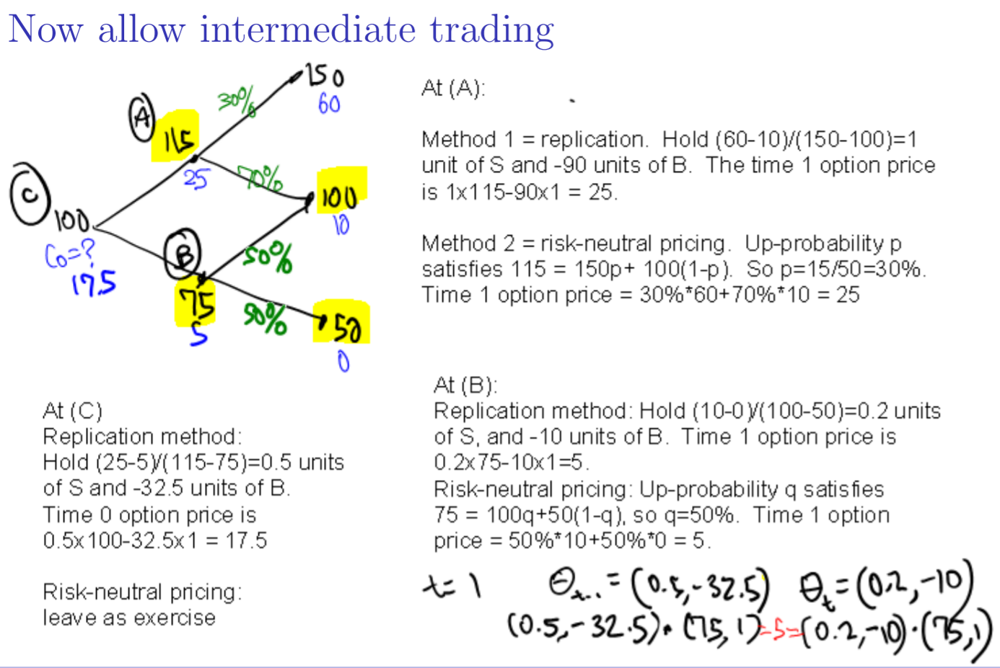

> date: 2021-10-18

## 一、随机过程

$\textbf{Definition(随机过程).}$ A **stochastic process** is a set of random variables, indexed by time

- Discrete time: the set of time points is countable, for example
  $$
  X_0, X_1, X_2, \cdots
  $$
  or
  $$
  X_{t_0}, X_{t_1}, X_{t_2}, \cdots,
  $$
  where $t_0 < t_1 < t_2 < \cdots$ 

- Continuous time: the set of time points is an interval, for example
  $$
  X_t, t>0
  $$
  or
  $$
  X_t, t\in[0, T].
  $$

$\textbf{Definition(随机游走).}$ A **random walk** (started at a non-random point $S_0$) is a stochastic process $S_0, S_1, S_2,\cdots$ such that
$$
S_n = S_0 + X_1+ X_2 + \cdots + X_n
$$
where $X_1, X_2, \cdots$ are independent and identically distributed random variables.

$\textbf{Example.}$ 

- 取 $S_0=0, \mathbb P(X_i = 1)= p,\mathbb P(X_i = -1) = 1 - p, 0 < p < 1$.
- Symmetric random walk: $p = \frac{1}{2}$.

 

在多阶段模型中（即在time-0至time-$T$间也可以发生交易），我们希望表示出，随着时间的流动，已知的信息慢慢被揭露，因此有如下定义：

$\textbf{Definition(Filtration).}$ 一个**信息流/域流/代数流（Filtration）**$\left\{\mathcal F_t:t \geq 0 \right\}$ 表示，对任意 $t$，所有在 $t$ 之前或在 $t$ 时已知的信息。

$\textbf{Definition(条件期望).}$ 有了信息流的定义，we can take expectations conditional on the information available at a given time. 条件期望 $\mathbb E(X|\mathcal F_t)$，简写为 $\mathbb E_t(X)$，是一个随机变量，它在 $\mathcal F_t$ 中每个信息集 $A$ 上的值为 $\mathbb E(X|A)$。

$\textbf{Example.}$ 先后在 $t_1, t_2$ 抛硬币，$\mathcal F_1$ 即为第一次抛硬币时可用的信息，也就是第一次抛出的硬币是 $U$ 或 （$U$ 代表up，$D$ 代表down）$D$；$\mathcal F_2$ 即为第二次抛硬币时的可用信息，即已知前两次抛出硬币的结果是 $UU$ 或 $UD$ 或 $DU$ 或 $DD$。

更准确地说，在每个 $t$ 时，总样本空间（sample space）被划分为不同的信息集（information set），我们知道我们位于哪个信息集中，但不知道最终结果会是信息集中的哪个。例如对上面这个例子，$t_1$ 时的信息集为 $\left\{UU, UD \right\}, \left\{DU, DD \right\}$，$\mathcal F_1$ is the set of those information sets and their unions; $t_2$ 时的信息集为 $\left\{UU \right\}, \left\{UD \right\}, \left\{DU \right\}, \left\{DD \right\}$，$\mathcal F_2$ is the set of those information sets and their unions。

取 $X$ 为硬币朝上的个数，则有
$$
\mathbb E(X|\mathcal F_1) = 
\left\{
\begin{aligned}
&1.5, \text{on} \ \{UU, UD\} \\
&0.5, \text{on} \ \{DU, DD\}
\end{aligned}.
\right.
$$
$\textbf{Remark(条件期望的性质).}$ 我们用记号 $\mathbb E_t X := \mathbb E(X|\mathcal F_t)$ 来表示 $X$ 的条件期望，对任意可积的（integrable）随机变量 $X, Y$，有

- 如果 $X$ 是关于 $\mathcal F_t$ 可测的（measurable wrt），那么有 $\mathbb E_t(XY) = X\mathbb E_t Y$。（"Taking out what's known"）

- 如果 $X$ 独立于 $\mathcal F_t$，那么有 $\mathbb E_t X = \mathbb EX$。

- 如果 $s < t$，那么有 $\mathbb E_s(\mathbb E_tX) = \mathbb E_sX$。（"Law of iterated expectations" / tower property）

  我们假设 $\mathcal F_0$ 是平凡的（trivial），即满足 $\mathbb E_0$ 等价于 $\mathbb E$。

 

$\textbf{Definition(适应过程，Adapted processes).}$ 如果 $Y_t$ 对每个 $t$ 都是 $\mathcal F_t$ 可测的，即 $Y_t$ 的值由 $\mathcal F_t$ 中的信息所决定，那么我们称随机过程 $Y$ 是**适应于** $\{\mathcal F_t\}$的（adapted to）。这代表 $Y_t$ 在 $\mathcal F_t$ 中的每个信息集上都是常数。

$\textbf{Example.}$ 例如，在期权定价中，

- 我们构建模型，使得资产价格 $X_t$ 是适应于 $\mathcal F_t$ 的。

  Interpretation: At time $t$ the market has revealed the price $X_t$.

- 我们构建投资组合，使得投资于资产的数量 $\theta_t$ 是适应于 $\mathcal F_t$ 的。

  Interpretation: Allow trading, but determined only by what has been revealed, not by future outcomes.

$\textbf{Definition(鞅).}$ 我们称 $M_t$ 是关于信息流 $\{\mathcal F_t\}$ 的**鞅（martingale）**，如果 $M_t$ 是适应于 $\{\mathcal F_t\}$ 的，并且对所有满足 $0 \leq t < T$ 的 $t, T$，依概率为1有
$$
\mathbb E_t M_T = M_t (= \mathbb E_t M_t).
$$
需要指出的是，$M_t$ 显然是关于 $\mathcal F_t$ 可测的，那么我们取 $Y=1$，由 $\mathbb E_t(XY) = X\mathbb E_t Y$ 可得 $M_t = \mathbb E_t M_t$。

Interpretations:

- Today's($t$) expectation of tomorrow's($T$) level is today's level.
- No "drift", no "trend", i.e., $\mathbb E_t(M_T - M_t) = 0$.

$\textbf{Example.}$ 

- 如果 $S$ 是一个对称的随机游走，那么 $S$ 是一个鞅。
- 如果 $X_t$ 是投硬币 $t$ 次中硬币朝上的个数，那么 $X_t$ 不是一个鞅。

 

$\textbf{Theorem(停时定理，Optional stopping theorem)}.$ 略.

## 二、Multi-period models: Arbitrage and Fundamental Theorem

在之前章节中，我们讨论的是一阶段模型，即time-0至time-$T$间无交易发生。我们下面讨论**多阶段模型（Multi-period model）**，即允许在time-0至time-$T$间发生交易（allow intermediate trading）。

$\textbf{Example}$.

 

$\textbf{Definition.}$ 我们称适应于 $\mathcal F_t$ 的序列 $\Theta_t$ 是一个**交易策略（trading strategy）**。序列 $\bf \Theta_t$ 实际上是在时间 $t$ 时，我们对一系列可交易资产对应的投资数量向量（view $\Theta_t$ as the vector of quantities of the tradeable assets held after all time-$t$ trading at prices $\textbf X_t$）。我们称一个交易策略是**自融资的（self-financing）**，如果对任意的 $t>0$，依概率为1有
$$
\mathbf \Theta_{t-1}\cdot\mathbf X_t = \mathbf\Theta_t \cdot \mathbf X_t.
$$
自融资即代表，组合价值从 $t$ 到 $t+1$ 的变动为
$$
V_{t+1} - V_t = \mathbf \Theta_{t+1} \mathbf X_{t+1} - \mathbf \Theta_t\mathbf X_t = \mathbf \Theta_t \mathbf X_{t+1} - \mathbf \Theta_t\mathbf X_t = \mathbf \Theta_t(\mathbf X_{t+1} - \mathbf X_t),
$$
即价格变动完全由资产价格的变动所决定。我们可以对价格变动从 $t= 0$ 至 $t=T-1$ 求和，可得
$$
V_T - V_0 = \sum_{t = 0}^{T-1} \mathbf \Theta_t \cdot (\mathbf X_{t+1} - \mathbf X_t),
$$
上式的连续形式为一个随机积分
$$
\int_0^T \mathbf\Theta_t \cdot \text{d} \mathbf X_t,
$$
P&L from a self-financing trading strategy is a stochastic integral, namely the integral of quantity with respect to price.

 

$\textbf{Definition.}$ 套利（Arbitrage）是一个自融资策略（self-financing trading strategy）$\mathbf \Theta_t$，使得 $V_t := \mathbf \Theta_t\mathbf X_t$ 满足
$$
\left\{
\begin{aligned}
&V_0 = 0, \\
&\mathbb P(V_T \geq 0) = 1, \\
&\mathbb P(V_T > 0) = 0, \\
\end{aligned}
\right.
$$
或
$$
\left\{
\begin{aligned}
&V_0 < 0, \\
&\mathbb P(V_T \geq 0) = 1. \\ 
\end{aligned}
\right.
$$
需要指出的是，静态投资组合（static portfolio）是上述自融资策略的一个特殊情况。

$\textbf{Remark.}$ arbitrage-free价格的一些性质：

- 如果 $\Theta_t^a$ 和 $\Theta_t^a$ 是自融资的，且满足 $\mathbb P(V_T^a \geq V_T^b) = 1$，那么有 $V_0^a \geq V_0^b$，否则存在套利（构建组合 $\Theta_t^a - \Theta_t^b$）。
- "Law of one price"：如果 $\Theta_t^a$ 和 $\Theta_t^b$ 是自融资的，且满足 $\mathbb P(V_T^a = V_T^b) = 1$，那么有 $V_0^a = V_0^b$，否则存在套利。

