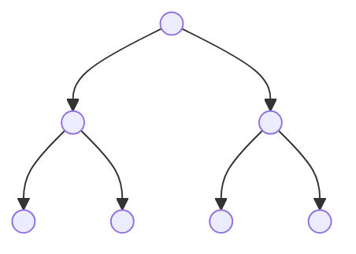
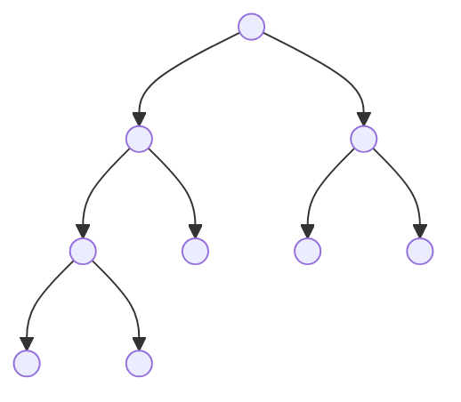

## 1. Array

array即向量。这里指的是（有序）列表。

还有linked list

Operation efficiency:

- Indexing $\mathcal O(1)$

- Insert/delete at beginning $\mathcal O(n)$

  Insert/delete at end $\mathcal O(1)$

  Insert/delete in middle $\mathcal O(n)$


典型解题思路：

- 2-pointers
- 遍历scan
- 使用其他结构如hash table


## 2. String

String即字符串。


典型解题思路：

- Brute Force 暴力求解
- Simulation 按题目指示去按步操作（更多考察coding实现能力
- Detail implementation
- Dynamic programming / Recursion 


## 3. Tree and Binary Tree

Tree即树，它不是线性结构。

node root

child $\longleftrightarrow$ parent

A leaf is a node with no children


Binary Tree即二叉树，是一种特殊的树结构。它最多只有两个子结点（child node），称为left child 和 right child。

full tree（满树）是指所有结点要么有两个子结点，要么没有子结点。



complete tree（完全树）是指从上到下，从左到右依次填满的树。



A **complete binary tree** is a binary tree in which all the levels are completely filled except possibly the lowest one, which is filled from the left.

A complete binary tree is just like a full binary tree, but with two major differences:
1. All the leaf elements must lean towards the left.
2. The last leaf element might not have a right sibling i.e. a complete binary tree doesn't have to be a full binary tree.


典型解题思路：

- recursion 递归

  先把base case写出来，然后通过层层调用自身来做


## 4. Hash Table (Dictionary)

Hash Table即哈希表。

Hash Map is a Key-Value pair.

Operation efficiency:

- Search: $\mathcal O(1)$
- Add/Delete: $\mathcal O(1)$

用array做的话，要先一个key-arr，再一个val-arr，有一个key进来，要先搜到这个key在哪

哈希表是无序的

A hash table is a collection of items which are stored in such a way as to make it easy to find them later. Each position of the hash table, often called a slot, can hold an item and is named by an integer value starting at 0.

For example, we will have a slot named 0, a slot named 1, a slot named 2, and so on.

Initially, the hash table contains no items so every slot is empty.

We can implement a hash table by using a list with each element initialized to the special Python value None.

Hash function (散列函数): $f(\text{key}) \mapsto \text{slot}$

哈希函数应满足：

- 输入不同，得到的输出不同；输出不同，对应的输入也应不同

哈希函数非常关键，十分影响运算时间复杂度


The mapping between an item and the slot where that item belongs in the hash table is called the **hash function**. The hash function will take any item in the collection and return an integer in the range of slotnames, between 0 and m-1. Assume that we have the set of integer items 54, 26, 93, 17, 77, and 31. Our first hash function , sometimes referred to as the "remainder method", simply takes an item and divides it by the table size, returning the remainder as its hash value ( h (item) = item%11 ). 取余

We now return to the problem of **collisions**. When two items hash to the same slot, we must have a systematic method for placing the second item in the hash table. This process is called collision resolution. As we stated earlier, if the hash function is perfect, collisions will never occur. However, since this is often not possible, collision resolution becomes a very important part of hashing. 


线性试探法：出现冲突就存到下一个

注意，这里的77 44等数字，是键值对的键，不是值


MD5, SHA


还有set结构


## 5. Heap and Stack

Heap即堆，Stack即栈

### 5.1 Basic Knowledge

max heap 最大堆/大顶堆，就是一个二叉树，并且左子结点一定小于右子结点

Heap is a specialized tree-based data structure which partially ordered. In a max heap, each parent node is greater than its children nodes.

Operation efficiency:

- Find max $\mathcal O(1)$ 根结点即为最大值

- Delete max $\mathcal O(\log n)$ 

  直观上，删除根结点后，我们一层一层从下往上，把最大的数字交换上去。二叉树深度约为 $\log_2 n$，因此复杂度也为 $\log n$

- Insert $\mathcal O(\log n)$ 

  插入与删除同理

因此，可以看到，最大堆最强大的功能即为给出最大值


Stack:

Most important property: last in, first out

Linear data structure

不能做index操作

Operation efficiency:

- Push $\mathcal O(1)$, adds an element to stack
- Pop $\mathcal O(1)$, removes the most recently added element that is not yet removed


适用Heap的题目包括：sort, selection, priority related questions

适用Stack的题目包括：expression evaluation, DFS, backtracking

还有queue结构


### 5.2 Questions

[top-k-frequent-elements](https://leetcode.com/problems/top-k-frequent-elements/)


[find-k-pairs-with-smallest-sums](https://leetcode.com/problems/find-k-pairs-with-smallest-sums/)


[remove-duplicate-letters](https://leetcode.com/problems/remove-duplicate-letters/)


## 6. DFS, Backtrack, and Recursion

DFS, Depth First Search, 深度优先搜索

Backtrack, 回溯法

recursion, （调用自己）迭代

### 6.1 Basic Knowledge

DFS:

- 一种经典的遍历算法，典型应用于Tree结构

- 基本思想：

  - 访问顶点；

  - 依次从顶点的未被访问的邻接点（adjacent）出发，进行深度优先遍历；直至图中有和顶点有路径相通的顶点都被访问。

  - 访问顺序：1 2 5 6 7；3 8；4 9

    ```mermaid
    graph TB
        A((1))-->B((2))
        A-->C((3))
        A-->D((4))
        B-->E((5))
        B-->F((6))
        B-->G((7))
        C-->H((8))
        D-->I((9))
        D-->J((10))
    ```


Backtrack:

- 与DFS关系密切，基本思想是：从一条路往前走，能进则进，不能进则退回来，换条路再试
- 使用DFS方法遍历状态空间，不过使用剪枝函数，剪去一些不可能到达最终状态（即答案状态）的结点，从而减少状态空间
- 从根结点出发，搜索至解空间树的任一结点时，先判断该结点是否肯定不包含问题的解。如果肯定不包含，则跳过对以该结点为根的子树的系统搜索，逐层向其祖先结点回溯。否则，进入该子树，继续按DFS的策略进行搜索
- 不一定跟树有关，但思想与DFS相似


### 6.2 Questions

[path-sum](https://leetcode.com/problems/path-sum/)


[jump-game-iii](https://leetcode.com/problems/jump-game-iii/)


## 7. Divide and Conquer

分治法

### 7.1 Basic Knowledge

将一个难以直接解决的大问题，分割成一些规模较小的相同问题

借助recursion

基本步骤：

- 分解：将原问题分解为若干个规模较小，相互独立，与原问题形式相同的子问题 （最关键）
- 解决：若子问题规模较小儿容易被解决则直接解，否则递归地解各个子问题
- 合并：将各个子问题的解合并为原问题的解


### 7.2 Questions

[majority-element](https://leetcode.com/problems/majority-element/)


[longest-substring-with-at-least-k-repeating-characters](https://leetcode.com/problems/longest-substring-with-at-least-k-repeating-characters/)


## 8. SQL


Top 25 SQL Interview Questions and Answers


[combine-two-tables](https://leetcode.com/problems/combine-two-tables/)


[customers-who-never-order](https://leetcode.com/problems/customers-who-never-order/)


[department-highest-salary](https://leetcode.com/problems/department-highest-salary/)


[average-salary-departments-vs-company](https://leetcode.com/problems/average-salary-departments-vs-company/)

这道题会员才能看

https://blog.csdn.net/weixin_44321080/article/details/108400952


[rank-scores](https://leetcode.com/problems/rank-scores/)


## 9. Greedy

贪心算法

### 9.1 Basic Knowledge

A greedy algorithm is any algorithm that follows the problem-solving heuristic of making the locally optimal choice at each stage. And by continuously solving the local optimal, we will finally get the global optimal point.

贪心即为每一步都选当前的最优

不像动态规划，贪心算法每一步不考虑下一步


### 9.2 Questions


[best-time-to-buy-and-sell-stock-ii](https://leetcode.com/problems/best-time-to-buy-and-sell-stock-ii/)


## 10. Dynamic Programming

动态规划

1. Dynamic programming is one of the most popular questions in OA and interviews.
2. The most common question is asking for the minimum/maximum value.
3. The core is to find the optimal sub-structure (最优子结构) of the problem.
4. Write down the correct state transition function (状态转移方程).
5. Implementation, usually with a dp-table.


以Fibonacci数列为例：

- 递归

  ```python
  def fibb(n):
      if n == 0 or n == 1:
          return 1
      else:
          return fibb(n-1) + fibb(n-2)
  ```

  递归计算非常非常慢

- 一种改进（这种叫做递推）：

  ```python
  dp = [0 for i in range(n)] # dp表
  dp[0], dp[1] = 1, 1
  for i in range(2, n):
      dp[i] = dp[i-1] + dp[i-2] # 状态转移方程
  ```

  打表（dp表/动态规划表），记录下来，这样是线性速度

  状态转移方程，就是最优子结构的数学表达

- 实际上，中间的状态都不重要，因此可以优化内存：

  ```python
  a = b = 1
  for i in range(n-1):
      a, b = b, a+b
  ```

  
