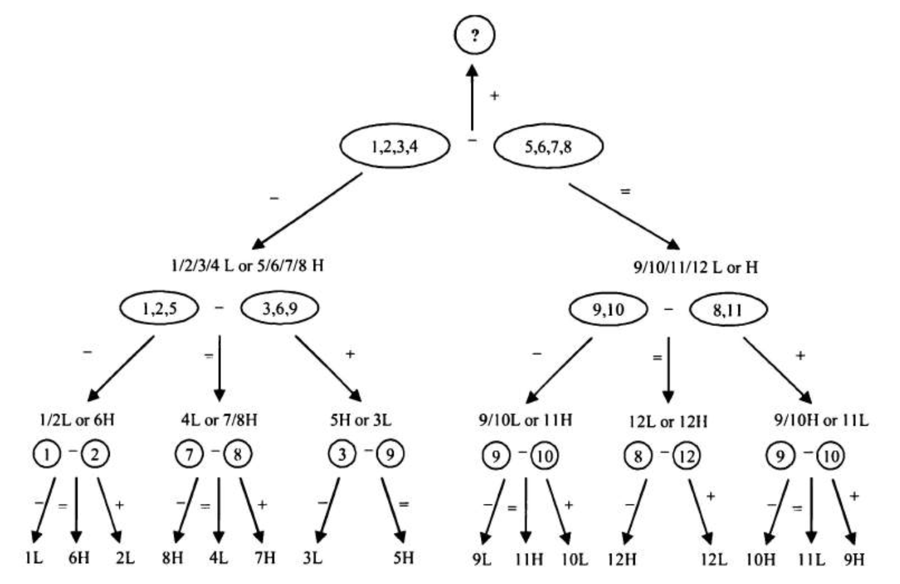
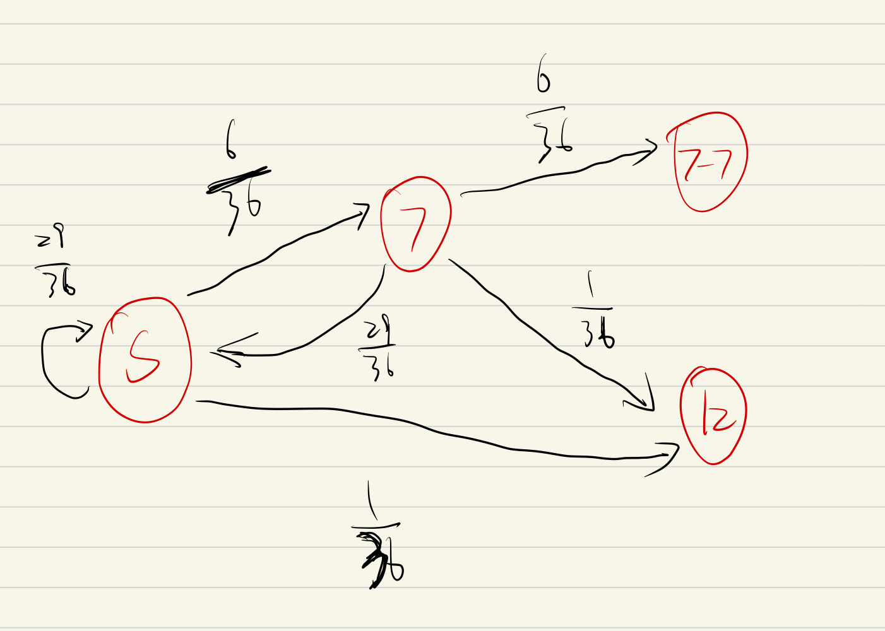
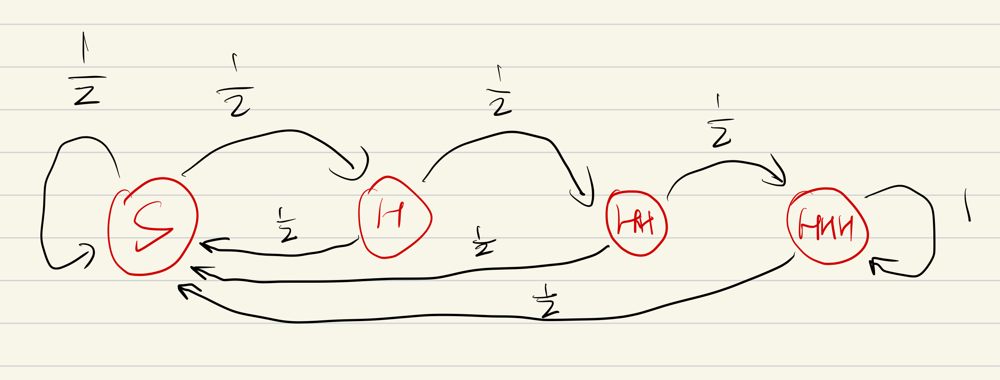
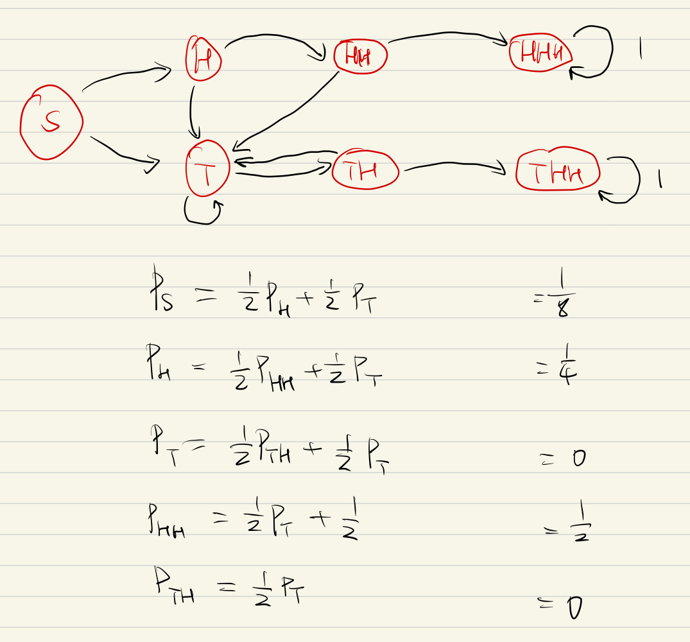

## 1. Brain-Teaser

- **Q1: Envelopes**

  You are given two indistinguishable envelopes, each containing money, one contains twice as much as the other. You may pick one envelope and keep the money it contains. Having chosen an envelop will, but before inspecting it, you are given the chance to switch envelopes. Should you switch?

  问题结果本身不重要

  原本X，换的话2X或者1/2 * X，期望算出来是5/4 * X，问题在哪？ 漏洞在换的话就是X或者2X，不存在1/2X一说

  

- **Q2: Screwy Pirates**

  5 pirates looted a chest full of 100 gold coins. Being a bunch of democratic pirates, they agree on the following method to divide the loot:
  A. The most senior pirate will propose a distribution of the coins.
  B. All pirates, including the most senior one, will then vote. If at least 50% of the pirates (3 in this case) accept the proposal, the gold is divided as proposed. If not, the most senior pirate will be fed to shark and the process starts over with the next most senior pirate...
  C. The process is repeated until the plan is approved.

  You can assume all pirates are perfectly rational:
  A. Stay alive first;
  B. Get as much gold as possible second;
  C. Finally, being bloodthirsty pirates, they want to have fewer pirates on the boat if given a choice between otherwise equal outcomes.

  How will the gold coin be divided in the end?

  首先，从最简单的情况，2个人开始。我们假设按照年幼顺序排名，1<2<3<4<5

  对于2个人的情况，2号海盗可以把所有金币全分配给自己，因为他投自己一票的话就可以通过提案。

  对3个人而言，如果3号的提案不通过，那么就会回到2个人的情况，此时1号就一块钱都拿不到。但是如果3号一块钱都不分给1号，1号就会愿意杀死3号，因此3号必须要给1号一块钱，这样1号和3号两票，就可以通过提案。

  对4个人而言，如果4号的提案不通过，那么就会回到3个人的情况，而3个人时2号是拿不到金币的。因此，4号只需要给2号提供一块钱，得到2号的一票，就可以通过分给自己99枚金币的提案。

  对5个人而言，如果5号的提案不通过，在4个人的情况时，1号和3号都没有钱拿，因此5号只需要分别给他们提供一枚金币，就可以通过提案。

  | 1号  | 2号  | 3号  | 4号  | 5号  |
  | :--: | :--: | :--: | :--: | :--: |
  |  0   | 100  |      |      |      |
  |  1   |  0   |  99  |      |      |
  |  0   |  1   |  0   |  99  |      |
  |  1   |  0   |  1   |  0   |  98  |


- **Q3: Tiger and Sheep**

  100 tigers and 1 sheep are put on a magic island that only has grass. Tigers can eat grass, but they would rather eat sheep. Assume:
  A. Each time only one tiger can eat one sheep, and that tiger itself will become a sheep after it eats the sheep.
  B. All tigers are smart and perfectly rational and they want to survive.
  So will the sheep be eaten?

  还是先从最简单的情况入手。

  如果只有2只老虎，那么只要有只老虎吃了羊，它就会变成羊，就会被另一只老虎吃掉，因此它不会这么做。所以在这种情况中，羊不会被吃。

  如果只有3只老虎，那么如果有老虎吃了羊，就变成了上面那种情况，因此它变成羊后不会被吃掉。所以在这种情况中，羊会被吃。

  以此类推，如果我们有100只老虎，则羊不会被吃。


- **Q4: Burning Ropes**
  You have 2 ropes, each of which takes 1h to burn. But either one has different densities at different points, so there's no quarantee of consistency in the time it takes different sections within the rope to burn. How do you use these two ropes to measure 45 min? 

  1根绳子要1h才能烧完，如果我们两头都点燃的话，1根绳子就只需要30分钟就能烧完。因此，我们同时把一根绳子的两头点燃，再把另一根绳子点燃，这样当一根绳子烧完时，刚好过了30分钟，此时再把另一根没烧完的绳子另一头也点燃，那么另一根绳子就会在15分钟内烧完，就是45分钟。


- **Q5: Defective Ball**

  You have 12 identical balls. One of the balls is heavier OR lighter than the rest (you don't know which). Using just a balance that can show you which side of the tray is heavier, how can you determine which ball is the defective one with 3 measurements?
  
  关键点在于将所有球分为3组，而不是2组，因为称了的2组可以反映出剩下1组球的信息。
  
  
  
  通常来说，如果知道有一个球时更轻的还是更重的，那么我们可以用不超过 n 步来找出 $3^n$ 个球中的假球，因为每次称重减少问题的 $2/3$ 复杂度。如果不知道假球是更轻还是更重，我们可以用不超过 n 步来找出 $(3^n - 3)/2$ 个球中的假球。


- **Q6: Trailing Zeros**

  How many trailing zeros are there in 100! (factorial of 100)?

  问trailing zeros，其实就是问100!里有多少组$10 = 2 \times 5$ 的因子。显然，包含因子为2的数字要多于包含因子为5的数字，因此，100!的trailing zeros数目就等于100!里分解出5的因子的个数。

  $100, 95, \cdots, 5$，共有20个包含因子5的数字。其中，$100, 75, 50, 25$，包含两个因子5，因此再+4，最后得到 $20+4 = 24$。

- **Q7: Horse Race**

  There are 25 horses, each of which runs at a constant speed that is different from the other horses'. Since the track only has 5 lanes, each race can have at most 5 horses. If you need to find the 3 fastest horses, what is the minimum number of races needed to identify them?
  
  
  
  首先，我们需要将每匹马都至少比赛一次；这一步之后，我们就可以把每组最后两名的马全部排除。
  
  然后，我们将5组里的头马都比赛一次；这样，排名第4、5的头马所在的组，也可以排除掉。排名第3的头马所在的组，其他所有马可以排除掉。排名第2的头马所在的组，排名最后的马可以排除掉。
  
  最后，我们只需要将除了排名第一的头马外，其他5匹马全部比一遍即可。


- **Q8: Race Track**

  Suppose that you are on a one-way circular race track. There are N gas cans randomly placed on different locations of the track and the total sum of the gas in these cans is enough for your car to run exactly one circle. Assume that your car and you can pick up the gas cans along the way to fill in your gas tank. Can you always choose a starting position on the track so that you can complete the entire circle?

  先考虑 $N=1,2$ 的情况；
  
  然后假设如果 $N=n$ 成立，则对任意一个 $N=N+1$，都可以找到将两个点合起来后，变成 $N=n$ 的情况，因此也成立。
  
  
  
- **Q9: Door to Offer**

  You are facing two doors. One leads to your job offer and the other leads to exit. In front of either door is a guard. One guard always tells lies and the other always tells the truth. You can only ask one guard one yes/no question. Assuming you do want to get the job offer, what question will you ask?

  问：Would the other guy say  that you are guarding the door to the offer?


- **Q10: Last Ball**

  A bag has 20 blue balls and 14 red balls. Each time you randomly take two balls out. (Assume each ball in the bag has equal probability of being taken.) You do not put these two balls back. Instead:
  A. If both balls have the same color, you add a blue ball to the bag;
  B. If they have different colors, you add a red ball to the bag.

  Assume that you have an unlimited supply of blue and red balls, if you keep on repeating this process, what will be the color of the last ball left in the bag? What if the bags has 20 blue balls and 13 red balls instead?

  画出所有可能结果：
  $$
  \begin{aligned}
  (B,B) \quad &\rightarrow \quad \text{Blue}-1\\
  (R,R) \quad &\rightarrow \quad \text{Blue}+1, \text{ Red}-2\\
  (B,R) \quad &\rightarrow \quad \text{Blue}-1
  \end{aligned}
  $$
  可以看到，只有抽到两个红球时，红球的数目才会真正减少。因此，决定最后一个球是什么颜色的因素即为袋子中红球数目的奇偶。如果有偶数个红球，那么最后一个拿的球即为蓝色；如果为奇数个红球，则最后一个拿的球即为红色。

  

- **Q11: Missing Integers**

  Suppose we have 98 distinct integers from 1 to 100. What is a good way to find out the two missing integers (within $[1, 100]$) ?

  （这题什么鬼 如果能做求和为啥不直接遍历一遍搜出来）
  $$
  \sum_{n=1}^{100}n = x+y+\sum_{i=1}^{98}z_i, \\
  \sum_{n=1}^{100}n^2 = x^2 +y^2 + \sum_{i=1}^{98}z_i^2,
  $$
  直接把 $x,y$ 解出来。$\mathcal O(n)$


- **Q12: Wise Men**

  A sultan has captured 50 wise men. He has a glass currently standing bottom down. Every minute he calls one of the wise men who can choose either to turn it over (set it upside down or bottom down) or do nothing. The wise men will be called randomly, possibly for an infinite number of times. When someone called to the sultan correctly states that all wise men have already been called to the sultan at least once, everyone goes free. But if his statement is wrong, the sultan puts everyone to death. The wise men are allowed to communicate only once before they get imprisoned into separate rooms (one person per room). Design a strategy that lets to the wise men go free.

  选其中的49个人，让他们在第一次看到瓶子是向上的时，将其翻成向下的，并且以后再被召见什么都不做；如果瓶子是向下的，则什么都不做。

  剩下一个人，看到如果瓶子是向下的，就将其翻成向上的。只要他看到过瓶子被翻成向下的49次后，就知道所有人都被召见过了。


- **Q13: Shaking Hands**

  A couple invited four other couples to join a party (five couples in total), everyone shook hands with people they didn't know. Then, the host asked everyone how many times they've shook hands and they gave all different answers. Assuming no one shook hands with their own partner, how many times did the hostess shake hands in the party?

  总共10个人，一个人不能跟自己握手，不能跟自己的另一半握手（认识的人），因此，剩下9个人的握手次数分别应为从8到0的九个自然数。

  从0到8对他们依次编号，那么8号除了自己的另一半和自己外，与其他任何人都握了手；因此，0号一定是8号的另一半，不然他不会握手次数为0；

  同理，得到7号与1号是夫妻，依次类推，主人的另一半握手次数必为4，自己的握手次数也为4。


- **Q14: Glass Balls**

  You are holding two glass balls in a 100-story building. If a ball is thrown out of the window, it will not break if the floor number is less than X, and it will always break if the floor number is equal or greater than X. You would like to determine X. What is the strategy that will minimize the number of drops for the worst case scenario?
  
  这一问可以被等价转化为：限定只能扔球 $N$ 次，最多我们可以探索几层楼？
  
  
  
  最差情况，就是 $N$ 层楼，即先从 $N$ 扔一个，碎了，接下来我们从1开始一路试上去；
  
  如果 $N$ 的情况没有碎，我们还可以地毯式向上试 $N-1$ 次，因此我们下一个球从 $N + (N-1)$ 层楼开始丢，如果碎了，我们就从 $N+1$ 层开始向上地毯式丢球；
  
  以此类推，我们最多可以探测出 $N(N+1)/2$ 层楼。取 $N=14$ 时，这个数字大于100，因此使用这个策略，最多探测14次。


## 2. Probability

### 2.1 Probability Basic Knowledge

Number of permutations (order matters) of $n$ things taken $r$ at a time:
$$
P(n, r) = \frac{n!}{(n-r)!}
$$
Number of different permutations of $n$ objects where there are $n_1$ repeated items, $n_2$ repeated items, ...
$$
\frac{n!}{n_1!n_2!\dots n_k!}
$$
Number of combinations (order does not matter) of $n$ things taken $r$ at a time:
$$
C(n, r) = \binom{n}{r} = \frac{n!}{(n-r)!r!}
$$
Binomial Theorem:
$$
(x + y)^n = \sum_{k=0}^n  \binom{n}{k}x^{n-k}y^k
$$
Inclusion-Exclusion Principle:
$$
P(A\cup B) = P(A) + P(B) - P(A\cap B) \\
P(A+B) = P(A) + P(B) - P(AB)
$$
$$
P(A+B+C) = P(A) +P(B) +P(C) -P(AB) - P(AC) -P(BC)+P(ABC)
$$

Conditional Probability:
$$
P(A|B) = \frac{P(AB)}{P(B)}, \quad P(AB) = P(A, B) = P(A\cap B)
$$
Law of Total Probability: for any mutually exclusive events $B_1, B_2, \dots, B_k$, whose union is the entire sample space, we have
$$
\begin{aligned}
P(A) &= P(A\cap B_1) + \cdots + P(A\cap B_k) \\
&= P(AB_1) + \cdots + P(AB_k)\\
&= P(A|B_1)P(B_1) + \cdots + P(A|B_k)P(B_k)\\
&=\sum_{i=1}^nP(A|B_i)P(B_i)
\end{aligned}
$$
各种概率分布，分布函数和期望方差


unbiased estimation

consistant

kurtosis and skew

center limit theorem

law of large number

converge in law/distribution, converge in probability


### 2.2 Questions

- **Q1: Card Game**

  A casino offers a simple card game. There are 52 cards in a deck with 4 cards for each value 2, 3, 4, ..., J, Q, K, A. Each time the cards are thoroughly shuffled (so each card has equal probability of being selected. You pick up a card from the deck and the dealer picks another one without replacement. If you have a larger number, you win; if the numbers are equal or yours is smaller, the house wins - as in all other casinos, the hours always has better odds of winning. What is your probability of winning?

  首先计算
  $$
  P(A = B) = 13 \times \frac{\binom{4}{2}}{\binom{52}{2}} = \frac{1}{17},
  $$
  则
  $$
  P(A < B) = P(A > B) = \frac{8}{17}.
  $$
  或者，总共有52张牌，抽取一张还剩51张，再抽一张跟自己一样的概率是
  $$
  \frac{3}{51} = \frac{1}{17}.
  $$
  
  另一种思路，
  $$
  0 + \frac{1}{13}\times \frac{4}{51} + \frac{1}{13} \times \frac{8}{51} + \cdots = \frac{4}{13}\times\frac{1+\cdots+12}{51} = \frac{8}{17}.
  $$
  
- **Q2: Drunk Passenger**

  A line of 100 airline passengers are waiting to board a plane. They each hold a ticket to one of the 100 seats on that flight. For convenience, let's say that the nth passenger in line has a ticket for the seat number n.

  Being drunk, the first person in line picks a random seat ( equally likely for each seat). All of the other passengers are sober, and will go to their proper seats unless it is already occupied; In that case, they will randomly choose a free seat. You're person number 100. What is the probability that you end up in your seat ( i.e. seat #100)?

  可以 by induction，如果只有两个乘客，则被占的概率是$0.5$；如果只有三个乘客，则被占的概率是$\frac{1}{3} + \frac{1}{3}\times\frac{1}{2} = 0.5$；如果只有4个乘客，则被占的概率是$\frac{1}{4} + \frac{1}{4}\times\frac{1}{2} + \frac{1}{4}\times\frac{1}{2} = \frac{1}{2}$；以此类推，概率有$\frac{1}{n} + (n-2)\frac{1}{n}\times\frac{1}{2} = \frac{1}{2}$。

  考虑全集：\{ #100在#1前被占，#1在#100前被占\}，第一种情况是肯定坐不到正确位置的，第二种情况是肯定能坐到正确位置的。这两种情况的概率是相等的：醉汉选#100还是#1的概率是相等的，如果他选了这其中其他的座位比如#$n$，那么本质上他让第$n$个人变成了醉汉，与第一个人是醉汉时的情况相同。


- **Q3: N Points on A Circle**

  Give N points drawn randomly on the circumference of a circle, what is the probability that they are all within a semicircle?

  先选定点$i$，剩下的$N-1$个点在该点顺时针半球内的概率概率为$\frac{1}{2^{N-1}}$。此时，对其他任意点 $j\neq i$，不能使得除了点 $j$ 外的所有点均在点 $j$ 顺时针半球内。因此，各个事件是mutually exclusive的，总概率为
  $$
  P\left( \bigcup_{i=1}^N E_i \right) = \sum_{i=1}^N P(E_i) = N \times \frac{1}{2^{N-1}},
  $$
  这个结论同样适用于弧$x\leq 1/2$。
  $$
  \binom{n}{1}\frac{1}{2^{N-1}}
  $$
  https://mathpages.com/home/kmath327/kmath327.htm
  
  https://www.zhihu.com/question/341018905/answer/1985433828


- **Q4: Hopping Rabbit**

  A rabbit sits at the bottom of a staircase with $n$ stairs. The rabbit can hop up only one or two stairs at a time. How many different ways are there for the rabbit to ascend to the top of the stairs?

  最后一跳可以是跳了两阶或者跳了一阶，我们即得到
  $$
  \#(N) = \#(N-1) + \#(N-2),
  $$
  有 $\#(1) = 1, \quad \#(2) = 2, \quad \#(3) = \#(2) + \#(1) = 3, \quad \#(4) = \#(3) + \#(2) = 5$，以此类推。

  这其实就是Fibonacci sequence，求其通项：
  $$
  \left[\begin{matrix}
  F_n \\ F_{n+1}
  \end{matrix}\right]
  =
  \left[\begin{matrix}
  0 & 1 \\ 1 & 1
  \end{matrix}\right]
  \left[\begin{matrix}
  F_{n-1} \\ F_n
  \end{matrix}\right], \text{ let } M = 
  \left[\begin{matrix}
  0 & 1 \\ 1 & 1
  \end{matrix}\right],
  $$
  对$M$做特征值分解，即可得到通式。
  $$
  M = P\Lambda P^{-1}, \quad \left[\begin{matrix}
  F_n \\ F_{n+1}
  \end{matrix}\right]
  =
  M^n
  \left[\begin{matrix}
  F_0 \\ F_1
  \end{matrix}\right]
  =
  P\Lambda^nP^{-1}\left[\begin{matrix}
  0 \\ 1
  \end{matrix}\right],
  $$

$$
\begin{aligned}
F_{n}=
\left[\begin{matrix}
1 & 0
\end{matrix}\right]
\left[\begin{matrix}
1 & 1 \\
\frac{1+\sqrt{5}}{2} & \frac{1-\sqrt{5}}{2}
\end{matrix}\right]
\left[\begin{matrix}
\left(\frac{1+\sqrt{5}}{2}\right)^{n} & 0 \\
0 & \left(\frac{1-\sqrt{5}}{2}\right)^{n}
\end{matrix}\right]
\left[\begin{matrix}
\frac{\sqrt{5}-1}{2 \sqrt{5}} & \frac{1}{\sqrt{5}} \\
\frac{\sqrt{5}+1}{2 \sqrt{5}} & -\frac{1}{\sqrt{5}}
\end{matrix}\right]
\left[\begin{matrix}
0 \\
1
\end{matrix}\right]
= \frac{\left(\frac{1+\sqrt{5}}{2}\right)^{n}-\left(\frac{1-\sqrt{5}}{2}\right)^{n}}{\sqrt{5}}
\end{aligned}.
$$


- **Q5: Chess Tournament**

  A chess tournament has $2^n$ players with skills $1 > 2 > \dots > 2^n$. It is organized as a knockout tournament, so that after each round only the winner proceeds to the next round. Except for the final, opponents in each round are drawn at random. Let's also assume that when two players meet in a game, the player with better skills always wins. What's the probability that players 1 and 2 will meet in the final?

  两两比赛，第一轮淘汰掉$2^{n-1}$个人。1和2相遇的情况只有一种，除了1之外的其他所有人与1相遇的概率均为$\frac{1}{2^n-1}$，因此1和2在第一轮不相遇的概率为$\frac{2^n-2}{2^n-1}$，以此类推得概率为
  $$
  \frac{2(2^{n-1}-1)}{2^n-1} \times \frac{2(2^{n-2}-1)}{2^{n-1}-1} \times \cdots \times \frac{2(2^{1}-1)}{2^{2}-1}=\frac{2^{n-1}}{2^n-1}.
  $$


- **Q6: Application Letters**

  You're sending job applications to 5 firms: Morgan Stanley, Goldman Sachs, JP Morgan, UBS and Merrill Lynch. You have 5 envelopes on the table neatly typed with names and addresses of people at these 5 firms. You even have 5 cover letters personalized to each of these firms. Your 3-year-old tried to be helpful and stuffed each cover letter into each of the envelopes for you. Unfortunately she randomly put letters into envelopes without realizing that the letters are personalized. What is the probability that all 5 cover letters are mailed to the wrong firms?

  首先，如果只有两张牌，那么全错只有1种情况；

  如果只有三张牌，那么全错只有2种情况；

  如果只有四张牌，总共有$4\times 3\times 2=24$种排列，只有一张牌是对的共有$\binom{4}{1} \times 2=8$种情况，只有两张牌是对的共有$\binom{4}{2}\times 1=6$种情况，全对有1种情况，加起来就是15种情况，因此全错只有$24 - 15=9$种情况；

  对于题目，我们只有五张牌，总共有$5\times4\times3\times2=120$种排列，那么只有一张牌是对的共有$\binom{5}{1}\times 9=45$种情况，只有两张牌是对的共有$\binom{5}{2}\times 2=20$种情况，只有三张牌是对的共有$\binom{5}{3}\times 1=10$种情况，全对只有1种情况，因此全错只有$120 - 45 - 20 - 10 - 1=44$种情况，概率即为
  $$
  \frac{44}{120} = \frac{11}{30}.
  $$
  还有另一种解法，见绿皮书第70页。

  

- **Q7: Birthday Problem**

  How many people do we need in a class to make the probability that two people have the same birthday more than 0.5? (for simplicity, assume 365 days a year)
  $$
  1 - \frac{365\times364\times\cdots\times(365-N+1)}{365^N} > \frac{1}{2},
  $$
  得到$N$最小为$23$。


- **Q8: Boys and girls**

  A company is holding a dinner for working mothers with at least one son. Ms. Jackson, a mother with two children is invited. What is the probability that both children are boys?

  考察条件概率，$\frac{1}{3}$；

  Your new colleague, Ms. Parker is know to have two children. If you see her walking with one of her children and that child is a boy, what is the probability that both children are boys?

  显然，$\frac{1}{2}$。

  

- **Q9: Unfair Coins**

  You are given 1000 coins. Among them, 1 coin has heads on both sides. The other 999 coins are fair coins. You randomly choose a coin and toss it 10 times. Each time, the coin turns up heads. What is the probability that the coin you choose is the unfair one?
  $$
  P(\text{Unfair}|\text{10 heads}) = \frac{P(\text{Unfair}, \text{10 heads})}{P(\text{10 heads})} = \frac{\frac{1}{1000}}{\frac{1}{1000} + \frac{999}{1000}\times\frac{1}{2^{10}}} = \frac{1024}{2023},
  $$
  约为0.5。

  

- **Q10: Fair Probability from An Unfair Coin**

  If you have an unfair coin, which may bias toward either heads or tails at an unknown probability, can you generate even odds using this coin?
  $$
  P(TH) = P(HT).
  $$
  扩展：可以等概率随机生成1\~5随机数，如何等概率随机生成1\~7随机数？

  生成两次，将生成的数字当做5进制，如：组合11映射为$1\times5+1=6$，组合55映射为$5\times5 + 5=30$。然后比如只保留7\~27这些数字时的结果，再对7取余。


- **Q11: Dart Game**

  Jason throws two darts at a dartboard, aiming for the center. The second dart lands farther from the center than the first. If Jason throws a third dart aiming for the center, what is the probability that the third throw is farther from the center than the first? Assume Jason's skillfulness is constant.

  见绿皮书76页

  第三次扔，跟前两次无关，那么第三次扔的最好（离中心最近）的概率是1/3，所以答案是2/3
  
  扔了三次，第几次是最好的概率都是1/3


- **Q12: Birthday Line**

  At a movie theater, a whimsical manager announces that she will give a free ticket to the first person in line whose birthday is the same as someone who has already bought a ticket.
  You are given the opportunity to choose any position in line. Assuming that your don't know anyone else's birthday and all birthdays are distributed randomly throughout the year (assuming 365 days in a year), what position in line gives you the largest chance of getting the free ticket?

  前$n-1$个人中，没有重复生日的概率为
  $$
  \frac{365\times \cdots \times (365-n+2)}{365^{n-1}},
  $$
  第$n$个人与前$n-1$个人生日有重合的概率为
  $$
  P(n)= \frac{365\times \cdots \times (365-n+2)}{365^{n-1}} \times \frac{n - 1}{365},
  $$
  这个概率在$n=20$时最大。

  （
  $$
  P(n) > P(n-1), P(n) > P(n+1)
  $$
  ）

  

- **Q13: Dice Order**

  We throw 3 dice one by one. What is the probability that we obtain 3 points in strictly increasing order?

  三个数字都不一样的概率为
  $$
  \frac{6\times5\times4}{6^3},
  $$
  这三个数字按照严格递增排序的概率为1/6，因此最后概率乘起来


- **Q14: Monty Hall problem**

  Monty Hall problem is a probability puzzle based on an old American show "Let's make a deal". The problem is named after the show's host. Suppose you are on the show now, and you are given the choice of 3 doors. Behind one door is a car; behind the other two are goats. You don't know ahead of time what is behind each of the doors.
  You pick one of the doors and announce it. As soon as you pick the door, Monty opens on of the other two doors that he knows has a goat behind it. Then he gives you the option to either keep your original choice or switch to the third door. Should you switch?
  What is the probability of winning a car if you switch?

  2/3


- **Q15: Amoeba Population**

  There is a one amoeba in a pond. After every minute the amoeba may die, stay the same, split into two or split into three with equal probability. All its offspring(后代), if it has any, will behave the same (and independent of other amoebas). What is the probability the amoeba population will die out?

  1只死的概率 = 1/4 + 1/4 * 1只死的概率 + 1/4 * (1只死的概率)^2 + 1/4 * (1只死的概率)^3

  得到
  $$
  x = \frac{1}{4} + \frac{1}{4} x + \frac{1}{4}x^2 + \frac{1}{4}x^3,
  $$
  即$x^3 + x^2 - 3x + 1 = 0, (x^3 + x^2 - 2x) - (x - 1) = 0,$
  $$
  (x - 1)(x^2 + 2x - 1) = 0,
  $$
  解得 $x = \sqrt{2} - 1$。


- **Q16: Candies in A Jar**

  You are taking out candies one by one from a jar that has 10 red candies, 20 blue candies, and 30 green candies in it. What is the probability that there are at least 1 blue candy and 1 green candy left in the jar when you have taken out all the red candies?

  这个概率可以转化为，红糖是第一种被拿完的糖的概率。该概率可以分为两部分：拿完糖的顺序为红蓝绿和红绿蓝。

  考虑如果只有红糖和蓝糖，则拿到最后一颗糖为蓝糖的概率为$20 / (10 + 20)$；

  因此，对总体而言，考虑拿完糖顺序为红蓝绿的概率，首先最后一颗糖为绿糖的概率为30/60，其次红糖与蓝糖而言，最后一颗糖为蓝糖的概率为20/30，因此总概率30/60 * 20/30；

  同理得到最终计算需要的概率为30/60 * 20/30 + 20/60 * 30/40 = 1/3 + 1/4 = 7/12


- **Q17: Coin Toss Game**

  Two players, A and B, alternatively toss a fair coin (A tosses the coin first, then B tosses the coin, then A, then B,...). The sequence of heads and tails is recorded. If there is a head followed by a tail (HT subsequence), the game ends and the person who tosses the tail wins. What is the probability that A wins the game?

  另$P(A)$为$A$赢的概率，condtion P(A) on A's first toss,
  $$
  P(A) = P(A|H)P(H) + P(A|T)P(T) = \frac{1}{2}P(A|H) + \frac{1}{2}P(A|T).
  $$
  如果第一次为H，则有一半概率第二次为T，此时B赢；一半概率第二次为H，此时B成为了第一次投出H的人，那么A应该赢的概率为$1 - P(A|H)$。因此有
  $$
  P(A|H) = \frac{1}{2}(1 - P(A|H)), P(A|H)=\frac{1}{3}.
  $$
  如果第一次为T，则对后续没有影响，此时相当于B成为了第一个投的人，而B第一个投赢的概率与A第一个投赢的概率一样。因此，给定第一次投出结果为T，此时A赢的概率 = 1 - B第一个投赢的概率 = 1 - A第一个投赢的概率 = 1 - P(A)，即
  $$
  P(A|T) = 1 - P(A).
  $$
  综上，有
  $$
  P(A) = \frac{1}{2} \times \frac{1}{3} + \frac{1}{2} \times (1 - P(A)), P(A) = \frac{4}{9}.
  $$


- **Q18: Aces**

  52 cards are randomly distributed to 4 players with each player getting 13 cards. What is the probability that each of them will have an ace?
  
  52张牌均匀分给4个人，共有
  $$
  \frac{52!}{13!13!13!13!}
  $$
  种分法（13!代表每个人拿到的13张牌不应该考虑顺序）。再将四张A预先分给4个人，有$4!$种分法，再把剩下48张牌均匀分为4个人，计算得到概率为
  $$
  \frac{4!\frac{48!}{12!12!12!12!}}{\frac{52!}{13!13!13!13!}} = \frac{13^4}{52\times51\times50\times49}.
  $$
  也可以认为，四张A分配给52个卡槽，现在首先分配好第一张A后，第二张A不与第一张A在同一个13张卡牌的概率是39/51，以此类推。


- **Q19: Gambler's Ruin Problem**

  A gambler starts with an initial fortune of i dollars. On each successive game, the gambler wins \$1with probability p, 0<p<1, or loses \$1 with probability q=1-p.
  He will stop if he either accumulates N dollars or loses all his money. What is the probability that he will end up with N dollars?

  假设初始为$i$时最终赢（到达$N$）的概率为$P_i$，则它应当满足
  $$
  P_i = pP_{i+1} + qP_{i-1},
  $$
  即
  $$
  (p+q)P_i = pP_{i+1} + qP_{i-1}, \\
  p(P_{i+1} - P_i) = q(P_i - P_{i-1}), \\
  \Longrightarrow \frac{P_{i+1} - P_i}{P_i - P_{i-1}} = \frac{q}{p},
  $$
  同时满足边界条件$P_0 = 0, P_N =1$。利用$P_0 = 0$，从$i=1$开始，计算得
  $$
  P_2 = (1 + \frac{q}{p})P_1, \\
  P_3 = \left(1 + \frac{q}{p} + \left( \frac{q}{p} \right)^2 \right)P_2,\\
  \cdots \\
  P_i = \sum_{j=1}^i \left(\frac{q}{p}\right)^{j-1}P_1.
  $$
  同时，利用$P_N=1$，可得
  $$
  P_N = 1 = \sum_{j=1}^N \left(\frac{q}{p}\right)^{j-1}P_1,
  $$
  这里分情况：

  - 如果$q/p = 1$，此时有$NP_1 = 1, P_1 = 1/N$，
    $$
    P_i = \frac{i}{N};
    $$

  - 如果$q/p \neq 1$，此时有
    $$
    \frac{1 - (q/p)^N}{1 - q/p}P_1 = 1, \\
    P_i = \frac{1 - (q/p)^i}{1 - q/p} \frac{1 - q/p}{1 - (q/p)^N} = \frac{1-(q/p)^i}{1-(q/p)^N}.
    $$
    


- **Q20: Cars on the Road**

  If the probability of observing at least one car on a highway during any 20-minute time interval is 609/625, then what is the probability of observing at least one car during any 5-minute time interval? Assume that the probability of seeing a car at any moment is uniform (constant) for the entire 20 minutes.

  将20分钟区间分成4个不重叠5分钟区间，设任意5分钟区间上没有车出现的概率为$p$，则有
  $$
  p^4 = 1 - \frac{609}{625}, \quad \Longrightarrow \quad p = \frac{2}{5}.
  $$
  因此，最终概率为$3/5$。


- **Q21: Probability Of Triangle**

  A stick is cut twice randomly (each cut point follows a uniform distribution on the stick), what is the probability that the 3 segments can form a triangle?

  Without loss of generality, assume the length of stick is 1. 同时假设三条边长为 $x, y, 1 - x - y$，此时它们应当满足 $0<x, y < 1, x+y<1$。该区域面积为$1/2$。

  如果该三条边能构成三角形，则有
  $$
  \left\{
  \begin{aligned}
  x + y &> 1 - x - y, \\
  1 - y &> y, \\
  1 - x &> x,
  \end{aligned}
  \right.
  $$
  即
  $$
  \left\{
  \begin{aligned}
  x + y &> \frac{1}{2}, \\
  y &< \frac{1}{2}, \\
  x &< \frac{1}{2},
  \end{aligned}
  \right.
  $$
  该区域面积为$1/8$。

  最终概率即为两区域面积的比值$1/4$。


- **Q22: Coin Toss Game**

  Two gamblers are playing a coin toss game. Gambler A has (n+1) fair coins; B has n fair coins. What is the probability that A will have more heads than B if both flip all their coins?

  我们可以考虑将A的硬币分为两部分，$n$ 枚硬币与剩下的 $1$ 枚硬币。用 $A^*$ 代表那 $n$ 枚硬币，那么这个时候我们知道
  $$
  P(A^* > B) = P(A^*<B),
  $$
  因为大家都是 $n$ 枚硬币，所以比对方多的概率都是相同的。设 $x = P(A^*>B) = P(A^*<B), y = P(A^*=B)$，则有 $2x+y=1$。

  下面考虑那多出来的一枚硬币：

  - 对于 $A^*>B$ 的情况，无论如何都还是A赢；
  - 对于 $A^* <B$ 的情况，最多能让 $A=B$，不可能让A赢；
  - 对于 $A^* =B$ 的情况，此时多出来的一枚硬币就很重要了，因为它能决定胜负。

  因此，我们可以得到
  $$
  P(A > B) =P(A^*>B) + P(A^*=B) \times \frac{1}{2} = x + \frac{1}{2}y = \frac{1}{2}(2x+y) = \frac{1}{2}.
  $$


- **Q23: Cubic of Integer**

  Let $x$ be an integer between $1$ and $10^{12}$, what is the probability that the cubic of $x$ ends with $11$?

  首先，个位如果是1，说明 $x$ 的个位必须是 $1$。同理，影响立方十位的只有 $x$ 的十位，我们设它是 $a$，经过运算就可以得到 $x^3$ 的十位即为 $3a$ 除 $10$ 的余数。如果它是 $1$，那么 $a$ 必须是 $7$。因此，即问 $1$ 到 $10^{12}$ 里，有多少数字的后两位是 $71$。

  每一百个数字中，会出现一个后两位是 $71$ 的数字，因此概率就是 $1/100$。

   

## 3. Statistics

### 3.1 Statistics Basic Knowledge

注：$EX, DX$分别为$\mathbb E[X], D[X]=Var[X]$的简写。
$$
\mathbb E\left( \sum_{i=1}^n X_i \right) = \sum_{i=1}^n \mathbb E(X_i).
$$
If $X,Y$ are independent, 
$$
\mathbb E[f(X)g(Y)] = \mathbb E[f(X)] \mathbb E(g(Y)), \\
Cov(X, Y) = \rho(X,Y) = 0.
$$
协方差为0不代表XY独立，因为它只能衡量一阶线性关系，二阶的衡量不了。

Variance:
$$
DX = EX^2 - (EX)^2.
$$
Covariance:
$$
Cov(X, Y) = \mathbb E[(X - EX)(Y-EY)] = E(XY) - EXEY, \\
D(X\pm Y) = DX+DY\pm 2Cov(X, Y), \\
Cov(X, X) = DX.
$$
Correlation:
$$
\rho(X, Y) = \frac{Cov(X, Y)}{\sqrt{DXDY}}, -1 \leq \rho \leq 1.
$$
General Rules of Variance and Covariance:
$$
Cov\left( \sum_{i=1}^n a_iX_i, \sum_{j=1}^m b_jX_j \right) = \sum_{i=1}^n \sum_{j=1}^m a_ib_jCov(X_i, X_j), \\
Var\left( \sum_{i=1}^n X_i \right) = \sum_{i=1}^n DX_i + 2 \sum_{j\neq i} Cov(X_i, X_j); \\

Cov(aX_1+bX_2,Y)=Cov(aX_1,Y) + Cov(bX_2,Y) = aCov(X_1, Y) + bCov(X_2, Y).
$$
Conditional Expectation and Variance:
$$
\mathbb E[g(X)|Y=y] = \sum_x g(x) p_{X|Y}(x|y) = \sum_x g(x) p(X=x|Y=y) = \int g(x)f_{X|Y}(x|y)dx.
$$
Law of Total Expectation:
$$
\mathbb E[X] = \mathbb E[\mathbb E[X|Y]] = \sum_x \mathbb E[X|Y=y]p(Y=y) = \int \mathbb E[X|Y=y]f_Y(y).
$$


### 3.2 Questions

- **Q1: Random Varibles**

  There are 3 random variables with same variance, each pair have same correlation coefficient. Calculate the possible range of this correlation.

  假设三个随机变量分别为 $X, Y, Z$，方差为 $\sigma^2$，相关系数为 $\rho$，则它们两两之间的协方差为 $\rho\sigma^2$。首先 $-1 \leq \rho \leq 1$，通常判断的话 $\rho$ 可以取1，但是不可以取-1，因为三者之间不可能都满足此消彼长。

  构建和事件
  $$
  Var(X + Y + Z),
  $$
  则它应当非负。因此有
  $$
  Var(X+Y+Z) = 3\sigma^2 + 6\rho\sigma^2 \geq 0, \quad \Longrightarrow \quad \rho \geq -\frac{1}{2}.
  $$
  这个问题也可以被延拓到n个随机变量的情况。

  补充：

  假设三个随机变量 $X_1, X_2, X_3$ 分别满足期望为0方差为1，则构造
  $$
  Y_i = X_i - \frac{1}{3}\sum_j X_j,
  $$
  此时的 $Y_i$ 之间相关系数即为-1/2。


- **Q2: Card Game**

  What is the expected number of cards that need to be turned over in a regular 52-card deck in order to see the first ace?

  假设 $X$ 为抽到第一张A时的抽牌总数，同时构造事件 $I_i, i = 1, \cdots, 48$，如果第 $i$ 张抽到的牌在第一张A前，则 $I_i=1$，否则为0。此时即有
  $$
  E[X] = E\left[ \sum_{i=1}^{48} I_i \right] + 1.
  $$
  同时，任意一张牌在第一张A前的概率都是相等的，且为1/5（想象四张A为四个锚点，然后将任一张牌插到这四个锚点构成的5个位置里），因此有 $E[I_i] = 1 \times \frac{1}{5} = 1/5$。$E[X] = 48/5 + 1 = 10.6$。

  推广：有 $m$ 张普通牌，$n$ 张特殊牌，那么抽到第一张特殊牌需要的牌数期望为 $1 + m/(n+1)$。

  

- **Q3: Sum of Random Variables**

  Assume that $X_1, X_2, \cdots,$ and Xn are independent and identically-distributed (IID) random variables with uniform distribution between 0 and 1. What is the probability that $S_n = X_1 + X_2+\cdots+X_n\leq1$?

  如果$n=2$，易得$1/2$；

  如果$n=3$，则概率为一个边长为1的三棱锥的体积，得$1/3 \times (1 \times1)/2 = 1/6$；

  因此，猜通式为$1 / n!$。

  By induction: assume $P(S_n\leq 1) = 1/n!$, then we have
  $$
  \begin{aligned}
  P(S_{n+1}\leq 1)
  &= P(S_n \leq 1 - X_{n+1}) \\
  &= \int_0^1 P(S_n\leq 1-X_{n+1}|X_{n+1}=x)p_{X_{n+1}}(x) \text dx \\
  &= \int_0^1 P(S_n \leq 1 - x)\text dx \\
  &= \int_0^1 \frac{(1-x)^n}{n!} \text dx \\
  &= \frac{1}{n!}\frac{-1}{n+1}(1 - x)^{n+1} \bigg|_0^1 \\
  &= \frac{1}{(n+1)!}.
  \end{aligned}
  $$
  
  

- **Q4: Coupon Collection**

  There are N distinct types of coupons in cereal boxes and each type, independent of prior selections, is equally likely to be in a box.
  1. If a child wants to collect a complete set of coupons with at least one of each type, how many coupons (boxes) on average are needed to make such a complete set?

     可以先从 $N=1,N=2$ 入手，有个大概的感觉。
  
     首先，抽到第一张券时，我们一定有了一个从未收集过的券，因此对收集的券来说，从0种到1种期望为1；
  
     在抽第二张券时，此时就变为了一个几何分布，接下来抽的每一次都有 $(N-1) / N$ 的概率抽到不是第一张抽到的券，即将我们的收集增加了一种券。几何分布的期望为发生概率的倒数，即 $N / (N-1)$，因此对收集券来说，从1种到2种期望为 $N / (N-1)$ 。
  
     以此类推，把所有期望全部加起来，即为
     $$
     \sum_{k=1}^N \frac{N}{N - k + 1}.
     $$
  
  2. If the child has collected n coupons, what is the expected number of distinct coupon types?
  
     构造事件 $I_k$，如果这 $n$ 个券中包含第 $k$ 张券，则 $I_k = 1$，否则为 $0$。因此有
     $$
     E\left( \sum_{i=1}^N I_k \right) = NE(I_k) = N \left( 1 - \left( \frac{N-1}{N} \right)^n \right).
     $$
     
  
- **Q5: Joint Default Probability**

  If there is a 50% probability that bond A will default (违约) next year and a 30% probability that bond B will default. What is the range of probability that at least one bond defaults and what is the range of their correlation?

  注意，这里并没有说明A和B之间的关系（是否不相关）。

  首先，A和B至少有一个违约，该事件即为A和B的和事件，有
  $$
  P(A+B) = P(A)+P(B)-P(AB),
  $$
  其中 $P(AB)$ 取值范围为 $[0, 30\%]$，因此 $P(A+B)$ 的取值范围为 $[50\%, 80\%]$。

  分别计算 $A, B$ 的期望和方差：
  $$
  EA = 0.5, \quad EB = 0.3; \\
  DA = 0.5 \times (1 - 0.5) = 0.25, \quad DB = 0.3 \times (1 - 0.3) = 0.21;
  $$
  其次，correlation可被计算为
  $$
  \rho = \frac{Cov(A, B)}{\sqrt{DA\times DB}},
  $$
  where
  $$
  Cov(A, B) = E[AB] - EA\times EB,
  $$
  其中 $E[AB]$ 的取值范围为 $[0, 0.3]$，计算得到 $\rho \in [-\sqrt{21}/7, \sqrt{21}/7]$。

   

- **Q6: Expected Value of Min and Max**

  Let $X_1, X_2, \cdots, X_n$ are IID random variables with uniform distribution between 0 and 1. What are the cumulative distribution function, the probability density function and expected value of $Y_n = \min(X_1, X_2, \cdots, X_n)$ and $Z_n = \max(X_1, X_2, \cdots, X_n)$?

  次序统计量的关键即为：
  $$
  P(Y_n \geq x) = \prod_{i=1}^n P(X_i \geq x), \\
  P(Z_n \leq x) = \prod_{i=1}^n P(X_i \leq x).
  $$
  如果给出 $X_i$ 的分布函数 $F(x)$ 与概率密度函数 $f(x)$，我们有
  $$
  F_{Y_n}(x) = 1 - (1 - F(x))^n, \quad f_{Y_n}(x) = F_{Y_n}'(x) = n(1 - F(x))^{n-1}f(x), \\
  F_{Z_n}(x) = F^n(x), \quad f_{Z_n}(x) = F_{Z_n}'(x) = nF^{n-1}(x)f(x).
  $$
  对0到1的均匀分布而言，我们有$F(x) = x, f(x)=1, 0 \leq x \leq 1$。代入即得
  $$
  F_{Y_n}(x) = 1 - (1 - x)^n, f_{Y_n}(x) = n(1 - x)^{n-1}; \\
  F_{Z_n}(x) = x^n, f_{Z_n}(x) = nx^{n-1}.
  $$
  计算期望：
  $$
  E[Y_n] = \int_0^1 n(1 - x)^{n-1} \cdot x \text dx = \frac{1}{n+1}; \\
  E[Z_n] = \int_0^1 nx^{n-1} \cdot x \text dx = \frac{n}{n+1}.
  $$
  补充计算二阶矩、方差：
  $$
  E[Y_n^2] = \int_0^1 n(1 - x)^{n-1} \cdot x^2 \text dx = \frac{2}{(n+1)(n+2)}; \\
  E[Z_n^2] = \int_0^1 nx^{n-1} \cdot x^2 \text dx = \frac{n}{n+2}.
  $$
  因此
  $$
  Var[Y_n] = E[Y_n^2] - (E[Y_n])^2 = \frac{2}{(n+1)(n+2)} - \frac{1}{(n+1)^2} = \frac{n}{(n+1)^2(n+2)}; \\
  Var[Z_n] = E[Z_n^2] - (E[Z_n])^2 = \frac{n}{n+2} - (\frac{n}{n+1})^2 = \frac{n}{(n+1)^2(n+2)}.
  $$
  
- **Q7: Correlation of Min and Max**

  Let $X_1$ and $X_2$ be IID random variables with uniform distribution between 0 and 1, $Y = \min(X_1, X_2)$ and $Z = \max(X_1, X_2)$. What is the probability of $Y\geq y$ given that $Z\leq z$ for any $y, z \in [0, 1]$? What is the correlation of $Y$ and $Z$ ?

  A figure is worth a thousand words. 画图即可得
  $$
  P(Y\geq y|Z\leq z) = \frac{(z-y)^2}{z^2}, 0\leq y\leq z, 0 \leq z \leq 1.
  $$
  对于相关系数，我们有
  $$
  Corr(Y, Z) = \frac{E[YZ] - EYEZ}{\sqrt{DYDZ}},
  $$
  其中期望和方差我们都算过了，有
  $$
  E[Y] = \frac{1}{3}, Var[Y] = \frac{1}{18};\\
  E[Z] = \frac{2}{3}, Var[Z] = \frac{1}{18}.
  $$
  要计算 $E[YZ]$，我们需要知道 $YZ$ 的联合分布，可以从第一问的条件概率入手：
  $$
  \begin{aligned}
  F(y, z)
  &= P(Y \leq y, Z\leq z)\\
  &= P(Y\leq y | Z\leq z)P(Z\leq z) \\
  &= [1 - P(Y \geq y|Z \leq z)] P(Z \leq z) \\
  &= [1 - \frac{(z - y)^2}{z^2}] \cdot z^2 \\
  &= 2zy - y^2, 0 \leq y\leq z, 0 \leq z \leq 1.
  \end{aligned}
  $$
  因此，求导即得到概率密度函数
  $$
  f(y, z) = 2,
  $$
  即有
  $$
  E[YZ] = \int_0^1 \int_0^z f(y, z)yz \ \text dy \text dz = \frac{1}{4}.
  $$
  另一种计算方法为，观察得到
  $$
  YZ = \min(X_1, X_2) \cdot \max(X_1, X_2) = X_1X_2,
  $$
  即有
  $$
  E[YZ] = E[X_1X_2] = E[X_1]E[X_2] = \frac{1}{2} \cdot \frac{1}{2} = \frac{1}{4}.
  $$
  代入计算得到
  $$
  Corr(Y, Z) = \frac{\frac{1}{4} - \frac{1}{3}\times\frac{2}{3}}{\frac{1}{18}} = \frac{1}{2}.
  $$


- **Q8: Dice Game**

  Suppose that you roll a dice. For each roll, you are paid the face value. If a roll gives 4, 5 or 6, you can roll the dice again. Once you get 1, 2 or 3, the game stops. What is the expected payoff of this game?
  $$
  EX = \frac{1}{6} \times 1 + \frac{1}{6} \times 2 + \frac{1}{6} \times 3 + \frac{1}{6} \times (4 + EX) + \frac{1}{6} \times (5+EX) + \frac{1}{6} \times (6+ EX), \\
  \Longrightarrow \quad EX = 7.
  $$


- **Q9: Monte Carlo**

  1. If you know how to generate uncorrelated random numbers, How do you simulate random numbers that have correlation?
     $$
     \left\{\begin{aligned}
     &X = Z_1, \\
     &Y = \rho Z_1 + \sqrt{1 - \rho^2}Z_2,
     \end{aligned}\right.
     $$
     这样使得
     $$
     \sigma_X^2 = \sigma_Y^2 = \sigma_Z^2, \quad Corr(X,Y) = \rho.
     $$

  2. How do you generate random numbers with distribution other than uniform distribution from uniform distributed random numbers?

     可以使用两种方法。

     - inverse transform method

       cumulative density function是服从0到1的均匀分布的，因此有
       $$
       u = F(x) = P(X\leq x) \sim U(0, 1),
       $$
       可以根据此推出得到
       $$
       x = F^{-1}(u).
       $$
       但是这种方法需要我们已知 $F^{-1}$，对于正态分布而言，其分布函数的反函数并没有analytical solution，因此并不高效。

     - acceptance-rejection method

       正态分布有pdf $f(x)$，但是不存在 $F^{-1}(u)$。此时，我们可以采用另一个随机变量 $Y$，有pdf $g(y)$ 与 $y = G^{-1}(u)$。例如，$\lambda=1$ 的指数分布 $g(y) = e^{-x}, G(y) = 1 - e^{-x}, G^{-1}(u) = -\ln(1-u)$，找个常量 $M$ 使得 $\forall y$，有
       $$
       \frac{f(y)}{g(y)} \leq M.
       $$
       例如对上述指数分布，我们有
       $$
       \frac{f(y)}{g(y)} = \frac{\frac{1}{\sqrt{2\pi}}e^{-\frac{x^2}{2}}}{e^{-x}} = \frac{1}{\sqrt{2\pi}}e^{x-\frac{x^2}{2}} < \frac{1}{\sqrt{2\pi}}e^{\frac{1 - (x-1)^2}{2}} \leq \frac{1}{\sqrt{2\pi}}e^{\frac{1}{2}} \approx 1.32, \quad \forall 0 < x < \infty.
       $$
       选取 $M = 1.32$，首先根据 $u\sim U(0, 1)$ 生成 $y = G^{-1}(u)$，即对指数分布的模拟；再生成 $v\sim U(0, 1)$，如果
       $$
       v \leq \frac{f(y)}{Mg(y)},
       $$
       则accept $x = y$；否则，重复上述步骤。
       $$
       P(\text{accept}) = \int P(\text{accept}|y) g(y) \text dy = \int\frac{f(y)}{Mg(y)}g(y) \text dy = \frac{1}{M};
       $$

       $$
       P_F(x \leq X \leq x +\epsilon) = \epsilon f(x);\\
       P_G(y \leq Y\leq y+\epsilon|Y \text{ accept}) = \frac{\epsilon g(y) \frac{f(y)}{Mg(y)}}{\frac{1}{M}} = \epsilon f(y).
       $$
       其原理大概理解为，把容易模拟的概率密度函数曲线乘一个常数 $M$，使得上移后的曲线一定能够完全包裹不好模拟的概率分布，再撒点，然后按照概率把撒在更低分布（计算不出来cdf反函数的分布）里的点取出来。
       
       ```python
       import numpy as np
       import pandas as pd
       import matplotlib.pyplot as plt
       
       #############
       
       N = 100000
       M = 1.32
       f = lambda x: 1 / np.sqrt(2 * np.pi) * np.e**(-x**2/2)
       g = lambda y: np.e**(-y)
       ls = []
       
       for i in range(N):
           u = np.random.random()
           y = -np.log(1 - u)
           if np.random.random() <= f(y) / (M * g(y)):
               if np.random.random() < 0.5:
                   x = y
               else:
                   x = -y
               ls.append(x)
       
       plt.hist(ls, bins=100)
       plt.show()
       ```
       
     
  


- **Q10: Min of Exponential Distribution**

  You have ten light bulbs. Five have an average life of 100 hours, and the other five have a average life of 200 hours. These light bulbs have a memoryless property in that their current age (measured in how long they have already been on) has no bearing on their future life expectancy. Assuming they are all already on, what is the expected number of hours before the first one burns out?

  首先，无记忆性告诉我们只可能是几何分布（离散）和指数分布（连续），因此这里我们的灯泡寿命即满足指数分布。期望为 $100$ 即告诉我们该指数分布的参数为 $\lambda = 1/100$。先说结论：$n$ 个指数分布的最小值依然是指数分布。$Y=\min_i X_i, X_i\sim Exp(\lambda_i),$
  $$
  p(x) = \lambda e^{-\lambda x}, x\geq0, \\
  P(X \leq x) = 1 - e^{-\lambda x}, x\geq 0,
  $$

  $$
  P(Y \geq y) = \prod_{i=1}^n P(X_i \geq x) = \prod_{i=1}^n e^{-\lambda_ix} = \exp (-x\sum_{i=1}^n \lambda_i), x \geq 0,
  $$

  即 $Y \sim Exp(\sum_{i} \lambda_i)$。

  本题中，$Y$ 服从参数为 $3/40$ 的指数分布。因此，$EY = 40/3$。

  

- **Q11: **

  Given a stick, if randomly cut into 3 pieces, what's the average size of the smallest, of the middle-sized, and of the largest pieces?

  这题有点复杂

  https://www.zhihu.com/question/507262676


- **Q12: **

  Consider linear regression of $Y$ on features $X_1, X_2$: Model1 - $(Y,X_1),R^2=0.1$; Model2 - $(Y, X_2),R^2=0.2$; Model3 - $(Y,X_1,X_2)$, calculate the range of $R^2$ of Model3.

  首先，
  $$
  R^2 = Corr(Y, X_1)^2,
  $$
  并且其中的 $Corr(Y,X_1)$ 类似于 $Y$ 于 $X_1$ 两个向量之间夹角的余弦值；如果对两个变量做回归，则类似于对 $X_1, X_2$ 平面的夹角的余弦值。

  因此，最大一定是1，即 $Y$ 跟 $X_1,X_2$ 在一个平面里；

  $Y$ 与平面的夹角，比 $Y$ 与平面里任意其他线的夹角都要小，转换为余弦值即更大，因此最小即取 $\cos^2 \theta_2 = 0.2$ 的情况。


- **Q13: **

  9 boys and 7girls sit in a circle, what's the expectation of the number of boy-girl neighbors?

  构建 $I_k$，当第 $k$ 个人与第 $k-1$ 个人是男女组合时，记为1，否则记为0.
  $$
  E[\sum_{i=1}^{16}I_k] = 16E[I_k] = 16 \times \frac{9\times 7}{\binom{16}{2}}.
  $$
  

### 3.3 Linear Regression

$$
Y = X\beta + \epsilon.
$$

假设：

- Linearity

  Scatter plot 有线性相关性

  $y\sim x, x^2, \sqrt{x}, \ln x$

- No multi-collinearity 

  数据集中的数据不能有太强的共线性

  如，$x_2 = 2x_1$，此时拟合得到的系数的估计区间会很大，系数会unstable

  Variance Inflation Factor, 
  $$
  VIF(x_i) = \frac{1}{1 - R_i^2},
  $$
  衡量共线性的程度，把第 $i$ 个自变量与其他自变量做回归，得到拟合优度，如果共线性强，则 $R_i^2$ 接近于1，VIF就会很大

  $VIF<5$ OK

  解决办法：feature selection; 根据domain knowledge, 把多个自变量合并为一个; ridge regression

- $Corr(\epsilon, X) = 0$

- $\{\epsilon_i\}$ 无自相关性 auto-correlation

  有自相关性的话，参数的方差又被低估

  Durbin-Watson: $\frac{\sum(\epsilon_t - \epsilon_{t-1})^2}{\sum \epsilon_t^2}$，约为2，无自相关；0到2，正相关；2到4，负相关；0到1或3到4的话，需要调整

  解决办法：引入新的feature；有可能有季节性，拟合 $y - f(t)$

- $Var(\epsilon_t)\sim\text{Constant}$

  heteroscedasticity 异方差性 存在的话，置信区间就会被低估

  做 $\hat \epsilon_t$ 与 $\hat y_i$ 的散点图，观察有无pattern

  做一个Box-cox transform，$y \sim x \rightarrow f(y) \sim x$，常用的变换为 $f(y) = (y^\lambda - 1)/\lambda, \lambda \neq 0;$ 或者 $f(y) = \ln y$  

- $\epsilon\sim Normal$

  QQ plot (Quantile) 

  Shapiro-Wilk test, KS test 

  一般样本量大的话，就是（或者接近）正态分布


模型本身：

Under the normality of the error terms assumption, the estimator of the slope coefficient will itself be normally distributed with mean $\beta$ and variance
$$
y = \alpha + \beta x
$$
$\beta$ 本身根据样本变化，也是随机变量，有自己的期望和方差

无偏估计，指期望就是真正的斜率：$E[\hat \beta] = \beta, Var[\hat \beta] = \sigma^2/\sum_i(x_i-\bar x)^2$
$$
\hat \alpha = \bar y - \hat \beta \bar x, \\
\hat \beta  = \frac{\sum_{i}(x_i-\bar x)(y_i - \bar y)}{\sum_i (x_i - \bar x)^2} = \frac{Cov(x, y)}{Var(x)}
$$
假设 $\epsilon_i \sim N(0, \sigma^2)$，计算似然得到相同的估计参数


If we double the X and Y data sets, and include the additional data in OLS regression, which would happen to the statistics?

把数据集重复一遍，可以得到 $Var[\hat \beta]$ 变小一半。


Ridge regression:

- 缓解 over-fitting
- 缓解 collinearity

- 有解析式


LASSO regression


## 4. C++ & Python

### 4.1 C++

Features:

- Object-Oriented Programming

  class, object

  Polymorphism 多态, abstraction

- High level language

- Case sensitive 区分大小写

- Compiler based

  先compile，再运行，compile后run的特别快

- Dynamic memory allocation 动态分配内存


Pointer:

- Store memory address 指向内存空间中存储地址 &a

- Null pointer 可以是空指针

- Pointer to function 函数指针，指向function所在的code

  ```c++
  int *ptr;
  void (*ptr_func)(int) = &func
  ```

  删除指针时，对应地址的东西也被删了

为了缓解上面问题，我们使用smart pointer

Smart Pointer:

- Prevent memory leak

  把指针改掉了，但是原指向的地址还存有东西，并且现在没有指针能索引到了，这就是内存泄漏

- Reference counting 多个指针指向同一个变量

  只有当指向同变量的指针数目降到0时，才删除变量

- Assigning ownership 

  ```c++
  p2 = move(p1)
  ```

  原指针变为空指针


Reference: 引用

变量的别名

- Less powerful but safer than pointer

- Cannot be null

- Must be initialized

  ```C++
  <Type>& <Name>
  int& b = a;
  ```

  

Const:

- Constant variable

  ```c++
  const int a = 5;
  ```

- Constant function

  function 里加，也表明不能对成员变量修改


Pass by Value/Reference:

```C++
void main() {
  int i = 10, j = 20;
  swapThemByVal(i, j);
  cout << i << " " << j << endl; // displays 10 20 不能更改外部变量，只改了函数内的num1 num2
  swapThemByRef(i, j);
  cout << i << " " << j << endl; // displays 20 10
}

void swayThemByVal(int num1, int num2){
  int temp = num1;
  num1 = num2;
  num2 = temp;
}

void swapThemByRef(int& num1, int& num2){
  int temp = num1;
  num1 = num2;
  num2 = temp;
}
```


Template Function:

- Generic type

  可以fit in不同类型的argument

```C++
template <typename T>
inline T max(T a, T b){
  return a > b ? a : b;
}

// This will call max<int> by implicit argument deduction.
std::cout << max(3, 7) << std::endl;

// This will call max<double> by implicit argument deduction.
std::cout << max(3.0, 7.0) << std::endl;
```


Type Conversion: 类型转换

- Implicit conversion

  ```C++
  int x = 10; // integer x
  char y=  'a'; // character c
  
  // y implicitly converted to int. ASCII
  // value of 'a' is 97
  x = x + y;
  ```

  限制：bool -> char -> int -> long -> float -> double

- Explicit conversion

  ```C++
  double x = 1.2;
  
  // Explicit conversion from double to int
  int sum = (int)x + 1; // 这里有信息丢失
  ```

- Conversion using cast

  ```C++
  float f = 3.5;
  
  // using cast operator
  int b = static_cast<int>(f); // 编译时做转换，因此一般最安全
  dynamic_cast // 运行的时候转换，一般用于基类子类指针
  reinterpret_cast // 最强的转换方式，不check类型是否转换
  ```

  

Static:

静态变量，即变量存在的lifetime是程序运行的时间，重复调用的时候不会重新生成不同的变量

- Static variable in function

  ```C++
  void demo()
  {
    // static variable
    static int count = 0;
    cout << count << " ";
    
    // value is updated and will be carried to 
    // next function calls
    count++;
  }
  
  int main()
  {
    for (int i=0; i<5; i++)
      demo();
    return 0;
  }
  ```

- Static member in class:

  不绑定于创建出的实例，而就是绑定于该类

  ```C++
  class GfG
  {
    public:
    
    // static member function
    static void printMsg(){
      cout << "Welcome to GfG!";
    }
  };
  
  // main function
  int main(){
    // invoking a static member function
    GfG::printMsg();
  }
  ```


Inheritance:

类的继承，降低代码的冗余度

```C++
public // 把基类中的public拿来作为子类的public
protected // 把基类中的public和protected拿来作为子类的protected
private // 把基类中的public和protected拿来作为子类的private
```

```C++
class Person { // base class
  ...
}

class MathsTeacher : public Person { // sub class
  ...
}
```


Virtual Function:

运行过程中的多态性 runtime polymorphism

```C++
class base {
    public:
    	virtual void print () {
            cout << "print base class" << endl;
        }
    	
    	void show () {
            cout << "show base class" << endl;
        }
};

class derived:public base {
    public:
    	void print () {
            cout << "print derived class" << endl;
        }
    	
    	void show () {
            cout << "show derived class" << endl;
        }
}

int main() {
    base *bptr;
    derived d;
    bptr = &d;
    
    // virtual function, binded at runtime
    bptr -> print(); // 使用的是子类中的
    // 结果：
    // print derived class
    
    // Non-virtual function, binded at compile time
    bptr -> show(); // 依然使用基类中的
    // 结果：
    // show base class
}
```


### 4.2 Python与C++的区别：

- Python

  Run through interpreter 不需要编译

  Dynamically typed 不需要double定义变量

  Inbuilt garbage collection 有自动的垃圾回收机制


- C++

  Pre-compiled

  Statically type

  Prone to memory leak


### 4.3 Python

- Decorator

- List & Tuple, List mutable(可变的), Tuple immutable

- Iterator

  ```
  __iter__
  __next__
  ```

- Gnerator

  function with yield keyword

  生成器的返回是迭代器

  https://www.runoob.com/python3/python3-iterator-generator.html

- GIL, Global Iterpreter Lock

  Multiple-thread 同时读写同一个文件

  可以采用multi-process


## 5. Data Structures

### 5.1 Array

 数组

Array or vector

- Index 

  元素可以直接被索引，$\mathcal O(1)$

- Address

  Continuous in memory

  找到array头部存储第一个元素的位置，就找到了整个array的位置

- Search

  查询元素，要一个一个查看，因此是 $\mathcal O(n)$

- Insert

  头部插入，则所有元素后移，因此 $\mathcal O(n)$

- Delete

  删头部元素，则所有元素前移，因此 $\mathcal O(n)$


### 5.2 List 

列表/链表

- Linked

  单向链表：Singly linked list

  双向链表：Doubly linked list

- Not continuous in memory

- Search

  查询元素也要一个个看，因此 $\mathcal O(n)$

- Insert

  单、双链表的插入操作，若给定前驱节点，则时间复杂度均为 $\mathcal O(1)$。否则只能按序或按值查找前驱节点，时间复杂度为 $\mathcal O(n)$

- Delete

  单向链表要删除某一节点时，必须要先通过遍历的方式找到前驱节点（通过待删除节点序号或按值查找）。若仅仅知道待删除节点，是不能知道前驱节点的，故单链表的增删操作复杂度为 $\mathcal O(n)$。 双向链表要删除某一节点时，由于是双向的，所以可以直接通过要删除节点里的pre指针得到要它的前驱节点，不必再进行遍历，故时间复杂度为 $\mathcal O(1)$。而如果只知道待删除节点的序号，则依然要按序查找，时间复杂度仍为 $\mathcal O(n)$


### 5.3 Binary Tree

二叉树

- Root, node, leaf

- Data, pointer to left child, pointer to right child

- BFS Breadth First Search 广度优先搜索

  简而言之，优先横着搜，一层一层搜下去

  利用Queue，每个节点弹出时，要把其左右子节点压入

- DFS Depth First Search 深度优先搜索

  简而言之，优先竖着搜

  利用Stack，每个节点弹出时，要把其左右子节点压入


Queue 队列:

- First in first out
- Push
- Pop
- BFS


Stack 栈:

- Last in first out
- Push
- Pop
- DFS


### 5.4 Hash Map

key value pair 键值对，根据键索引值；无序

例如，Python里的字典

- Key value pair

- Hash function

  Hash map 的具体实现用到哈希函数，哈希函数是一个以字符串作为自变量的函数，输出（比如）一个地址，然后把对应的值存储到对应地址的bucket

  f(key) = value

  性质：

  - value不同，则key肯定不同
  - key微小变化，value变化很大

- Search

  给定键，查询是 $\mathcal O(1)$

- Insert

  同查询，$\mathcal O(1)$

- Delete

  同查询，$\mathcal O(1)$

- Collision

  如果出现冲突，可以选择：

  - 存储到下一个位置
  - 在该位置构建一个链表，继续挂在下面


### 5.5 Set

集合

集合里每个元素都是唯一的

- Unordered

- No duplicate

- Hash function

- Search

  查询当前元素在不在列表内，直接通过hash function运算，查看对应位置有无元素，$\mathcal O(1)$

- Insert

  用hash function查看一下，想存储元素对应的位置有没有元素，没有就存进去

  $\mathcal O(1)$

- Delete

  $\mathcal O(1)$


## 6. Programming Algorithms

Sort Algorithms:

- Bubble sort

  冒泡排序

  一轮一轮比较相邻两个，第一轮可以把最大的数换到最右边，以此类推

  时间复杂度 $\mathcal O(n^2)$，空间复杂度 $\mathcal O(1)$

- Merge sort

  归并排序，面试问的不少

  采用 divide and conquer

  将两个有序子列，合并为一个序列。如，135 和 246，分别在两个序列头部放置指针，每次互相做比较，然后合并为一个序列

  将我们序列中的每个元素，看做是一个有序子列，不断应用归并操作

  需要归并 $\log n$ 次，每次归并的复杂度为 $n$，因此时间复杂度 $\mathcal O(n\log n)$；空间复杂度 $\mathcal O(n)$

- Quick sort

  快速排序

  思想也是 divide and conquer

  

  时间复杂度 $\mathcal O(n\log n)$，最坏情况 $\mathcal O(n^2)$；空间复杂度 $\mathcal O(1)$


## 7. Machine Learning 

### 7.1 Logistic Regression

逻辑回归，（二）分类算法

- Formulaic
  $$
  \ell = \log \frac{p}{1-  p} = \beta_0+ \beta_1x_1+ \beta_2x_2,
  $$
  化简得到
  $$
  p = \frac{1}{1+e^{-(\beta_0+\beta_1x_1 + \beta_2x_2)}}.
  $$
  fit $\ln p/(1-p)$, range $(-\infty,\infty)$.

  主要目的：计算
  $$
  P(Y=0|X,\theta), P(Y=1|X,\theta).
  $$

- Loss function

  Likelihood function: 写出所有数据点的联合分布

  对单个数据点来说，$y_i=1, l_i=p; y_i=0,l_i=(1-p)$。$L = \prod_i l_i$

  loss function即为$\min -\ln L = \min -\sum_i \ln P(Y = y_i|x_i)$ 

- Evaluation

  Deviance: 
  $$
  -2 \ln \frac{\text{Likelihood of fitted model}}{\text{Likelihood of saturated model}},
  $$
  Saturated model 里参数的个数等于训练数据集的规模，即 $\# \beta_i = \#\{x_i\}$ 

  根据感觉，ln里的通常小于1，因此deviance > 0；当fitted接近saturated，说明效果好，此时deviance接近0。因此，deviance越小越好。

  简化版：直接把分母换为1

  还可以用 $R_L = \frac{D_{null}-D_{fitted}}{D_{null}}$

- 优点：Easy to implement and interpret

- 缺点：Too strong assumption of linearity


### 7.2 Naive Bayesian Classifier

朴素贝叶斯，（多）分类算法

适合小样本

假设：各个维度独立（conditional independence），乘积就是联合分布（强假设）

- Formulaic 
  $$
  \hat y = \mathop{\arg\max}_{k \in \{1, \ldots,K\}}p(C_k)\prod_{i=1}^np(x_i|C_k),
  $$
  $X$ 是 $n$ 维的，要会推最简单的条件概率，模型是怎么过来的

  对于Gaussian分类器，即假设 $P(x_i|C_k) = N(\mu_k,\sigma_k^2)$ 

- Estimation

  参数估计：likelihood

- 优点：Simple, need less training data (small dataset)

- 缺点：Too strong assumption of conditional independence


### 7.3 k-Nearest Neighbors

k近邻，分类算法

- Mode label among k nearest training samples
- K is user-defined constant
- Robust to noisy training data 离群值不咋影响
- Need to determine K, large computation cost
- K一般取奇数 odd


### 7.4 Decision Tree

决策树，分类算法

可解释

- Gini Impurity

  构造决策树，可以基于Gini系数来分裂
  $$
  I_G(p) = \sum_{i=1}^Jp_i \sum_{k\neq i}p_k,
  $$

  越小说明分布的越均匀，因此我们希望它更大

  $p_i$ 是属于第 $i$ 类的概率 ？

  计算按规则分为两类后，基尼系数的和，希望尽可能大

- Information Gain
  $$
  H(T) = -\sum_{i=1}^J p_i \log_2 p_i,
  $$
  希望这个指标尽可能小

  如果属于不同类的概率都是平均大的，那么信息增益就会很大，这是不希望看到的

- Easy to interpret, white box model

- Non-robust, overfitting


### 7.5 Support Vector Machine

支持向量机，（二）分类算法

- Hyperplane 超平面

  找到一个超平面，使得两类分的最开（margin最大）

  点到平面 $wx - b$ 距离：$b/\|w\|$，
  $$
  \max \frac{wx-b}{\|w\|} = \frac{1}{\|w\|},  \quad \text{s.t.} \quad y_i(wx_i-b)\geq 1;
  $$

- Loss function

  Hinge loss:
  $$
  \max(0, 1 - y_i(wx_i-b)),
  $$
  再加上 $\lambda \|w\|^2$，得到
  $$
  \max \frac{1}{\|w\|} \quad \Longleftrightarrow \quad \min \|w\|^2,
  $$

  $$
  \min \frac{1}{n}\sum_i \xi_i + \lambda \|w\|^2, \quad \text{s.t.} \quad y_i(wx_i-b)\geq 1 - \xi_i;
  $$

  找出dual，得到
  $$
  \max f(c) = \max \sum_{i=1}^n c_i - \frac{1}{2}\sum_{i=1}^n \sum_{j=1}^n y_ic_i(x_i\cdot x_j)y_ic_j, \\
  \text{s.t.} \quad \sum_{i=1}^n c_iy_i=0; \forall i, 0\leq c_i \leq \frac{1}{2n\lambda}.
  $$

- Kernel

- Convex optimization, regularization 收敛速度快

  可以处理小数据集

- Hard to determine the key parameters


### 7.6 Neural Network

神经网络

- Activation function
- Loss function
- Back propagation
- Strong fitting ability, scale well to large data sets
- Large computation cost, unexplained behavior


## 8. Stochastic Calculus

### 8.1 Basic Knowledge

Markov Process/Chain:

(One Step) Transition matrix $P = \{p_{ij}\}$, $p_{ij}$ is the transition probability of state $i$ to state $j$；每行加起来等于1

t-step transitions: $P^t$

Initial probabilities: 
$$
P(X_0) = \left( P(X_0=1), P(X_0=2), \cdots, P(X_0 = M) \right), \quad \sum_{i=1}^M P(X_0 = i) = 1.
$$
The probability of a path:
$$
P(X_1, =i_1, X_2 =  i_2, \cdots, X_n=i_n|X_0=i_0) = p_{i_0i_1}p_{i_1i_2}\cdots p_{i_{n-1}i_n}.
$$
Transition graph: A transition graph is often used to express the transition matrix graphically.

Expected time to absorption: $\mu_i=0$ for absorbing state, $\mu_i = \sum_{j}p_{ij}\mu_j$ for transient state.

Martingale:
$$
E[|Z_n|] < \infty, E[Z_{m}|\mathcal F_n] = Z_n, m>n.
$$
Stopping time

Wald's Equality: 
$$
S_N = X_1+ \cdots X_N, \\
\Longrightarrow E[S_N] = E[E[S_N|N]] = E[NEX] = EXEN.
$$
Dynamic Programming (DP) Algorithm: 绿皮书页码122

Brownian Motion:

- $B_0=0$
- $B_t-B_s$ is independent of $B_r$, $r\leq s\leq t$
- $B_t - B_s \sim N(0, t-s)$
- Continuous paths $t\mapsto B_t$ is a continuous function

- Other properties:
  - $B_t$ is martingale
  - $B_t^2 - t^2$ is a martingale
  - $e^{\lambda B_t - \frac{1}{2}\lambda^2 t}$ is a martingale (exponential martingale)


### 8.2 Questions

- **Q1: **

  Player M has \$1 and player N has \$2. Each game gives the winner \$1 from the other. As a betterp layer, M wins 2/3 of the games. They play until one of the is bankrupt. What is the probability that M wins?

  直观地，写出M的转移概率矩阵
  $$
  P = \left[\begin{matrix}
  1 & 0 & 0 & 0\\
  \frac{1}{3} & 0 & \frac{2}{3} & 0\\
  0 & \frac{1}{3} & 0& \frac{2}{3}\\
  0 &0 &0 & 1
  \end{matrix}\right].
  $$
  
  我们用 $p_0$ 表示 $M$ 从\$0开始玩赢的概率，以此类推。显然，$p_0=0,p_3=1$。有
  $$
  p_1 = \frac{1}{3}p_0 + \frac{2}{3}p_2, \\
  p_2 = \frac{1}{3}p_1 + \frac{2}{3}p_3, \\
  $$
  联立解得 $p_1 = 4/7$。
  
  在这里，状态0和状态3是常返态（absorbing state），状态1和状态2是非常返态/顺过态（transient state）。对Markov链而言，对任意的 $t$，$X_t$ 都有对应的概率分布。如果我们取
  $$
  \pi_0 = \left(P(X_0 = 0), P(X_0 = 1),P(X_0 = 2),P(X_0 = 3) \right) = (0, 1, 0, 0),
  $$
  那么每把 $\pi_0$ 左乘一次概率转移矩阵，我们得到的即是对应 $X_t$ 的分布。例如，$\pi_0 P$ 得到的向量即为 $X_1$ 的分布。因此，我们可以通过无限乘 $P$，来得到 $\lim_{t\rightarrow \infty} P(X_t = 3)$，这个概率也是我们想要得到的概率。
  
  ```python
  import numpy as np
  
  P = np.array([
      [1, 0, 0, 0],
      [1/3, 0, 2/3, 0],
      [0, 1/3, 0, 2/3],
      [0, 0, 0, 1]
  ])
  
  pi_0 = np.array([[0, 1, 0, 0]])
  
  temp = pi_0 @ P
  for i in range(10000):
      temp = temp @ P
  print(temp)
  print(4/7)
  ```
  
  那么如何计算 $\lim_{t\rightarrow \infty} \pi_0P^t$ 呢？常见的做法是对 $P$ 做特征值分解。这里补充另一个做法。
  
  https://lips.cs.princeton.edu/the-fundamental-matrix-of-a-finite-markov-chain/
  
  我们重新构建概率转移矩阵，将其化为如下形式：
  $$
  P = \left[\begin{matrix}
  Q & R \\
  0 & I
  \end{matrix}\right],
  $$
  其中，$Q$ 代表 transient state 之间的转移概率，$R$ 代表 transient state 到 absorbing state 之间的转移概率，$0$ 代表 absorbing state 到 transient state 之间的转移概率，$I$ 代表 absorbing state 之间的转移概率（即为单位矩阵，以概率为1转移至自己本身）。通过简单的计算，可以得到
  $$
  P^t = \left[\begin{matrix}
  Q^t & N_tR \\
  0 & I
  \end{matrix}\right],
  $$
  其中
  $$
  N_t = I + Q + + Q^2 + \cdots + Q^{t-1}.
  $$
  在极限状态下，我们留在 transient state 的概率趋近于0，因此，我们重点只需要计算 $N_tR$。根据矩阵代数，我们有
  $$
  \lim_{t\rightarrow \infty} N_t = (I-Q)^{-1}.
  $$
  在本题中，经过变换的概率转移矩阵如下：
  
  | State / Probability |       1       |       2       |       0       |       3       |
  | :-----------------: | :-----------: | :-----------: | :-----------: | :-----------: |
  |        **1**        |       0       | $\frac{2}{3}$ | $\frac{1}{3}$ |       0       |
  |        **2**        | $\frac{1}{3}$ |       0       |       0       | $\frac{2}{3}$ |
  |        **0**        |       0       |       0       |       1       |       0       |
  |        **3**        |       0       |       0       |       0       |       1       |
  
  计算得到
  $$
  I - Q = \left[\begin{matrix}
  1 & -\frac{2}{3} \\
  -\frac{1}{3} & 1
  \end{matrix}\right],
  $$
  其伴随矩阵（先求代数余子式，再转置）为
  $$
  (I-Q)^* = 
  \left[\begin{matrix}
  1 & \frac{2}{3} \\
  \frac{1}{3} & 1
  \end{matrix}\right],
  $$
  行列式为 $|I-Q| = 7/9$，因此逆矩阵为
  $$
  (I-Q)^{-1} = \frac{(I-Q)^*}{|I-Q|} =
  \left[\begin{matrix}
  \frac{9}{7} & \frac{6}{7} \\
  \frac{3}{7} & \frac{9}{7}
  \end{matrix}\right],
  $$
  得到
  $$
  P^\infty = 
  \left[\begin{matrix}
  0 & (I-Q)^{-1}R \\
  0 & I
  \end{matrix}\right],
  $$
  其中
  $$
  (I-Q)^{-1}R = 
  \left[\begin{matrix}
  \frac{3}{7} & \frac{4}{7} \\
  \frac{1}{7} & \frac{6}{7}
  \end{matrix}\right].
  $$
  将 $\pi_0$ 按照 state 顺序(1, 2, 0, 3)排列，得到 $\pi_0 = (1, 0, 0, 0)$，左乘 $P^{\infty}$ 即得到最终落到state为3的概率为 $4/7$。
  
  ```python
  P = np.array([
      [1, 0, 0, 0],
      [1/3, 0, 2/3, 0],
      [0, 1/3, 0, 2/3],
      [0, 0, 0, 1]
  ])
  
  Q = np.array([
      [0, 2/3],
      [1/3, 0]
  ])
  R = np.array([
      [1/3, 0],
      [0, 2/3]
  ])
  P_ = np.block([
      [Q, R],
      [np.zeros((2, 2)), np.eye(2)]
  ])
  
  pi_0 = np.array([[0, 1, 0, 0]])
  
  temp = P_
  for i in range(10000):
      temp = temp @ P_
  print(temp)
  
  print(np.linalg.inv(np.eye(2) - Q) @ R)
  ```


- **Q2: Dice Question**

  Two players bet on roll(s) of the total of two standard six-face dice. Player A bets that a sum of 12 will occur first. Player B bets that two consecutive 7s will occur first. The plavers keep rolling the dice and record the sums until one player wins. What is the probability that A wins?

  可以构建类似上题的Markov链。我们只需要4个state，分别是7, 7-7, 12, S，其中S代表起始状态/其他状态，可以得到
  $$
  p_{S,7} = p_{7, 7-7} = \frac{6}{36}, \\
  p_{S,12} = p_{7, 12} = \frac{1}{36}, \\
  p_{7,S} = p_{S, S} = \frac{29}{36}, \\
  p_{7-7, 7-7} = p_{12, 12} = 1.
  $$
  

  因此，类似地，假设A从 state S 开始玩赢的概率为 $p_S$，我们有 $p_{7-7}=p_{12}=1$，
  $$
  p_S = \frac{29}{36}p_S + \frac{6}{36}p_7 + \frac{1}{36}p_{12}, \\
  p_7 = \frac{29}{36}p_S + \frac{6}{36}\times 0 + \frac{1}{36}p_{12},
  $$
  联立解得 $p_S = 7/13$。


- **Q3: Coin Triplets**

  1. If you keep on tossing a fair coin, what is the expected number of tosses such that you can have HHH (heads heads heads) in a row? What is the expected number of tosses to have THH in a row?

    

    代入公式得
  $$
    \mu_S = 1 + 0.5\mu_S + 0.5\mu_H,\\
    \mu_H = 1 + 0.5\mu_S + 0.5\mu_{HH}, \\
    \mu_{HH} = 1 + 0.5 \mu_S + 0.5 \mu_{HHH},\\
    \mu_{HHH}=0.
  $$
    解得 $\mu_S = 14$。同理计算得另一个答案为8。

  2. Keep flipping a fair coin until either HHH or THH occurs in the sequence. What is the probability that you get an HHH subsequence before THH?

    


- **Q4: Drunk Man**

  A drunk man is at the 17th meter of a 100-meter-long bridge. He has a 50% probability of staggering forward or backward one meter each step. What is the probability that he will make it to the end of the bridge (the 100th meter) before the beginning (the 0th meter)? What is the expected number of steps he takes to reach either the beginning or the end of the bridge?

  以17为原点，即 $X_0=17$，未来的位置为 $S_N = X_0 + \sum_{i=1}^NX_i$。我们有 $S_N$ 与 $S_N^2 - N$ 都是鞅，因此
  $$
  E[S_N] = E[S_0], \quad \Longrightarrow \quad P(S_N=83) \times83 - P(S_N=-17) \times 17 = 0,
  $$
  得到 $P(S_N = 83) = 0.17$；
  $$
  E[S_N^2 - N] = E[S_0^2], \quad \Longrightarrow \quad 83^2 \times 0.17 + 17^2 \times 0.83 - E[N] = 0,
  $$
  得到 $E[N] = 83 \times 17 = 1441$。


- **Q5: Brownian Motion**

  1. $P(B_1 >0, B_2 < 0) = P(B_1>0)P(B_2-B_1<0)P(|B_2-B_1|>|B_1|) = 1/8$

  2. What is the mean of the stopping time for a Brownian motion to reach either -1 or 1?

     Using the fact that $B_t^2 - t$ is a martingale.
     $$
     E[B_\tau^2 - \tau] = E[B_\tau^2] - E[\tau] = 0, \quad \Longrightarrow \quad E[\tau] = 1.
     $$

  3. Let W(t) be a standard Wiener process and $\tau_x (x>0)$ be the first passage time to level x ($\tau_x = \min \{\tau_x; W(t) = x\}$).
     What is the probability density function of $\tau_x$ and the expected value of $\tau_x$?

     又称passage time

     直接查阅Lawler的书

  4. Suppose that X is a Brownian motion with no drift, i.e., $dX_t=dW_t$. If X starts at 0, what is the probability that X hits 3 before hitting -5? What if X has drift m, i.e., $dX_t = mdt + dW_t$?
     $$
     E[X_\tau] = 3 \times p - 5\times(1 - p) = E[X_0] = 0,
     $$
     得到 $p=5/8$。

     如果 $X_t$ 不是鞅，则构建
     $$
     e^{\lambda W_t - 0.5\lambda^2t},
     $$
     它是鞅。取 $\lambda = -2m$，得到
     $$
     Y_t =e^{\lambda W_t - 0.5\lambda^2t} = e^{-2m (X_t - mt) - 0.5\times4m^2t} = e^{-2mX_t},
     $$
     因此有
     $$
     E[Y_\tau] = E[Y_0] = 1, \quad \Longrightarrow \quad e^{-2m\times 3}\times p + e^{2m\times 5}\times(1-p) = 1, p = \frac{e^{10m}-1}{e^{10m}-e^{-6m}}.
     $$

  5. Suppose $dX_t = dt+dW_t$, what is the probability that X ever reaches -1?

     类似上一问，将上一问中的3和-5分别替换为-1与正无穷，即得到结果 $e^{-2}$。

  6. Let $Z_t = \sqrt t B_t$, what is the mean and variance of $Z_t$? Is $Z_t$ a martingale process?

     $EZ_t = 0, Var[Z_t] = t\times Var[B_t] = t^2$.
     $$
     dZ_t = \frac{1}{2\sqrt t}dt + \sqrt tdB_t,
     $$
      not martingale

  7. Is $W_t^3$ a martingale process?
     $$
     dW_t^3 = 3W_tdt+3W_t^2dW_t,
     $$
     not martingale

     补充：$W_t^n, n >1$，都不是鞅


- **Q6: Dice Game**

  Suppose that you roll a dice. For each roll, you are paid the face value. If a roll gives 4, 5 or 6, you can roll the dice again. Once you get 1, 2 or 3, the game stops. What is the expected payoff of this game?

  这个题前面做过，这里用随机过程的角度求解。
  $$
  S = Y_1 + Y_2 + \cdots + Y_T, \\
  E[S] = E[Y_i]E[T],
  $$
  $T$ 服从一个几何分布，成功率为 $1/2$，因此有
  $$
  E[S] = \frac{\sum_{i=1}^6 i}{6} \times 2 = 7.
  $$

- 


- **Q7: Ticket Line**

  At a theater ticket office, $2n$ people are waiting to buy tickets. $n$ of them have only \$5 bills and the other $n$ people have only \$10 bills. The ticket seller has no change to start with. If each person buys one \$5 ticket, what is the probability that all people will be able to buy their tickets without having to change positions?

  绿皮书118页

  本质上，一张\$5的bill，就可以解决找给1一张\$10 bill的零钱，因此我们可以建模为，\$5的即+1，\$10的即-1，这样一个随机过程。题目问题即转化为有多少条above x轴的path。

  如果我们将所有到达过 -1 的路径，if we reflect the path across the line $y=-1$ after a path first reaches -1, for every path that reaches (2n, 0) at step 2n, we have one corresponding reflected path that reaches (2n, -2) at step 2n.

  因此，所有到达过 -1 的路径总数，与我们有 $n-1$ 次上升、$n+1$ 次下降的路径总数相同，为
  $$
  \binom{2n}{n-1}
  $$
  条。概率即为
  $$
  \frac{\binom{2n}{n} - \binom{2n}{n-1}}{\binom{2n}{n}} = \frac{1}{n+1}.
  $$
  


## 9. Derivatives

### 9.1 Basic Knowledge

Effect on Stock Option Pricing:

|          Variable          | European call | European put | American call | American put |
| :------------------------: | :-----------: | :----------: | :-----------: | :----------: |
|    Current stock price     |       +       |      -       |       +       |      -       |
|        Strike price        |       -       |      +       |       -       |      +       |
|     Time to expiration     |       ?       |      ?       |       +       |      +       |
|         Volatility         |       +       |      +       |       +       |      +       |
|       Risk-free rate       |       +       |      -       |       +       |      -       |
| Amount of future dividends |       -       |      +       |       -       |      +       |

欧式期权与到期时间的关系，与是否价内有关


Greeks:

- Delta: to Stock Price
  $$
  \Delta = \frac{\partial \Pi}{\partial S}
  $$

- Gamma: to Delta
  $$
  \Gamma = \frac{\partial^2 \Pi}{\partial S^2}
  $$

- Vega: to Volatility
  $$
  \mathcal V = \frac{\partial \Pi}{\partial \sigma}
  $$

- Theta: to Time to Maturity
  $$
  \Theta = \frac{\partial \Pi}{\partial t}
  $$


Duration and Convexity:

P is the price of the bond and y is yield to maturity. The duration of a bond is defined as
$$
D = -\frac{1}{P}\frac{dP}{dy} = -\frac{\frac{dP}{P}}{dy},
$$
既衡量价格与利率之间的敏感度，也衡量 weighted average (by time) of the cash flow；P就是dicounted cash flow

The convexity of a bond is defined as
$$
C = \frac{1}{P}\frac{d^2P}{dy^2}.
$$
Applying Taylor's expansion:
$$
\frac{\Delta P}{P} \approx -D\Delta y + \frac{1}{2}C\Delta y^2.
$$
When y is small:
$$
\frac{\Delta P}{P} \approx -D\Delta y.
$$
For a fixed-rate 

bond with coupon rate and time-to-maturity T:

$T\uparrow \Rightarrow D \uparrow$; $c\uparrow \Rightarrow D \downarrow$; $y\uparrow \Rightarrow D \downarrow$; $T\uparrow \Rightarrow C \uparrow$; $c\uparrow \Rightarrow C \downarrow$; $y\uparrow \Rightarrow C \downarrow$

coupon c 上升，则短期的点权重上升，因此D下降


Put-Call Parity:
$$
c + Ke^{-rt} = p+S-D,
$$
where the European call option and the European put option have the same underlying security, the same maturity T and the same strike price K. Since $p\geq 0$, we can also derive boundaries for c from the put call parity:
$$
S-D-Ke^{-rt}\leq c \leq S.
$$
For American options, the equality no longer holds and it becomes two inequalities:
$$
S-D-K\leq C-P\leq S-Ke^{-rt}
$$


### 9.2 Questions

- **Q1: American vs European Options 1**

  Since American options can be exercised at any time before maturity, they are often more valuable than European options with the same characteristics. But when the stock pays no dividend, the theoretical price for an American call and European call should be the same since it is never optimal to exercise the American call. Why should you never exercise an American call on a non-dividend paying stock before maturity?

  即在问为什么提前行权总是不如直接卖掉，即证明 $c_A > S-K$。
  $$
  c_A > c_E = p +S-Ke^{-rt} > S - Ke^{-rt} > S-K.
  $$
  直接利用 put-call parity 


- **Q2: American vs European Options 2**

  An European put option on a non-dividend paying stock with strike price \$80 is currently priced at \$8 and a put option on the same stock with strike price \$90 is priced at \$9. Is there an arbitrage opportunity existing in these two options?

  价格关于 strike price 应当是convex的，即二阶导大于0；但现在呈现的是线性关系，因此画图可知，对应\$80的期权价格被高估了。

  

  因此，我们short高估，take a long positive of 低估，即 short 1 份 $K_1=80$，take a long positive of $8/9$ 份 $K_2=90$。最后的payoff:
  $$
  \text{payoff} = 
  \left\{\begin{aligned}
  0, & \quad S_T \geq 90 \\
  \frac{8}{9}(90-S_T), & \quad 80\leq S_T < 90\\
  \frac{1}{9}S_T, &\quad S_T< 80
  \end{aligned}\right.
  $$


- **Q3: Black-Scholes-Merton Differential Equation**

  Can you write down the Black-Scholes-Mertons differential equation and briefly explain how to derive it?
  $$
  \frac{\partial V}{\partial t} + rS \frac{\partial V}{\partial S} + \frac{1}{2}\sigma^2S^2 \frac{\partial^2 V}{\partial S^2} = rV.
  $$
  Starting point:
  $$
  dS_t = S_t(rdt + \sigma dW_t),
  $$
  by Ito lemma,
  $$
  dV(t, S_t) = \frac{\partial V}{\partial t} + \frac{\partial V}{\partial S_t}dS_t + \frac{1}{2} \frac{\partial^2 V}{\partial S_t^2}d \langle S\rangle_t,
  $$
  构建投资组合
  $$
  \Pi = V - \frac{\partial V}{\partial S}S,
  $$
  则/假设
  $$
  d\Pi =(\frac{\partial V}{\partial t}+ \frac{1}{2}\sigma^2S^2\frac{\partial^2 V}{\partial S^2})dt = r\Pi dt \text{ (no arbitrage)}.
  $$


- **Q4: Black-Scholes-Merton Assumptions**

  What are the assumptions behind the Black-Scholes formula?

  - The stock price follows a geometric Brownian motion with constant drift $\mu$ and volatility $\sigma$

    股价服从几何布朗运动

  - There are no risk-free arbitrage opportunities

    No arbitrage

  - The risk-free interest rate is constant and known

    所有 risk-free asset 应该有相同收益率

    Long/Short 没有 restriction, cash rate = $r_f$

  - All securities are perfectly divisible

    股票交易数量可以无限细分 any amount

  - No transaction costs or taxes;

    the proceeds of short selling can be fully invested


- **Q5: Option Worth**

  Assume zero interest rate and a stock with current price at \$1 that pays no dividend. When the price hits level \$H (H>1) for the first time you can exercise the option and receive \$1. What is this option worth to you today?

  利率为0，则股价满足
  $$
  dS_t = \sigma dW_t,
  $$
  计算得到
  $$
  d \ln S_t = -\frac{1}{2}\sigma^2 dt + \sigma dW_t, \\
  \ln S_t = -\frac{1}{2}\sigma^2 t + \sigma W_t.
  $$
  下面即计算，相比于 $-\infty$，先reach $\ln H$ 的概率是多少。
  $$
  W_t = \frac{\ln S_t + \frac{1}{2}\sigma^2t}{\sigma},
  $$
  取 $\lambda = \sigma$，得到 martingale
  $$
  e^{\lambda W_t - \frac{1}{2}\lambda^2 t} = e^{\ln S_t} = S_t.
  $$
  因此，$E[S_t] = S_0 = 1$，即有
  $$
  p\times H + (1 - p) \times 0 = 1, \quad \Longrightarrow \quad p = \frac{1}{H}.
  $$


- **Q6: Value**

  Assume a non-dividend paying stock follows a geometric Brownian motion. What is the value of a contract that at maturity T pys the inverse of the stock price observed at the maturity?

  即 $V_T = 1/S_T$，求 $V_0$.
  $$
  V_t = e^{-r(T-t)}E[V_T],
  $$
  有
  $$
  dS_t = S_t(rdt + \sigma dW_t), \\
  dV_t = \frac{1}{S_t}\left((-r + \sigma^2)dt - \sigma dW_t \right) = (-r+\frac{\sigma^2}{2})Vdt - \sigma VdW_t,
  $$
  因此
  $$
  d \ln V_t = (-r + \frac{\sigma^2}{2})dt - \sigma dW_t,
  $$
  得到
  $$
  \ln V_T = \ln V_t + N\left((-r+ \frac{\sigma^2}{2})(T-t), \sigma^2(T-t) \right),
  $$
  即
  $$
  E[V_T] = \frac{1}{S_t} e^{(-r+ \sigma^2)(T-t)},\\
  V_t=  \frac{1}{S_t}e^{(-2r+\sigma^2)(T-t)}.
  $$

- 


- **Q7: Delta**

  What is the delta of European call option on a non-dividend paying stock? How do you derive the delta?

  我们知道 $\Delta = N(d_1)$

  要会求导


- **Q8: At-The-Money Option**

  What is your estimate of the delta of an at-the-money call on a stock without dividend? What will happen to delta as the at-the-money option approaches maturity date?
  $$
  d_1 = \frac{(r+ \frac{\sigma^2}{2})(T-t)}{\sigma\sqrt{T-t}} = (\frac{r}{\sigma}+ \frac{\sigma}{2})\sqrt{T-t}> 0,
  $$
  因此 $\Delta = N(d_1) > 0.5$。当 $t\rightarrow T$，$d_1 \rightarrow 0$，得到 $\Delta \rightarrow 0.5$。


- **Q9: Hedging Position**

  You just entered a long position for a European call option on GM stock and decide to dynamically hedge the position to eliminate the risk from the fluctuation of GM stock price. How will you hedge the call option? If after your hedge, the price of GM has a sudden increase, how will you rebalance your hedging position?
  $$
  d_1 = \frac{\ln \frac{S}K{ + (r + \frac{\sigma^2}{2})(T-t)}}{\sigma\sqrt{T-t}},
  $$
  因此 $S\uparrow,d_1\uparrow, N(d_1)=\Delta\uparrow$，即要short更多的股票。


- **Q10: Estimate the Value**

  Can you estimate the value of an at-the-money call on a non-dividend paying stock? Assume the interest rate is low and the call has short maturity.

  根据题，有 $S=K, t\approx T$，因此
  $$
  c = SN(d_1) - Ke^{-r(T-t)}N(d_2) = S(N(d_1)-N(d_2)),
  $$
  即如何近似 $N(d_1)-N(d_2)$。
  $$
  N(d_1) - N(d_2) \approx N'(0)(d_1 - d_2) = \frac{1}{\sqrt{2\pi}}\sigma\sqrt{T-t},
  $$
  即
  $$
  c\approx \frac{S}{\sqrt{2\pi}}\sigma\sqrt{T-t} \approx 0.4\sigma S\sqrt{T-t}.
  $$

- 


- **Q11: Binary Options**

  What is the price of a binary (cash-or-nothing digital) European call option on a non-dividend paying stock if the stock price follows a geometric Brownian motion? How would you hedge a cash-or-nothing call option and what's the limitation of your hedging strategy?
  $$
  \text{payoff} = 
  \left\{\begin{aligned}
  0, & \quad S_T \leq K \\
  1, & \quad S_T > K
  \end{aligned}\right.
  $$
  在risk-neutral measure下计算 $P(S_T>K)$，价格最后就是 $P(S_T>K)e^{-rT}$。

  结论：$P(S_T>K) = P(\text{call option in the money}) = N(d_2)$

  Delta hedge: 求 $\partial P / \partial S = e^{-rT}N'(d_2)/(S\sigma\sqrt T)$


- **Q2: Exchange Options**

  How would you price an exchange call option that pays $\max(S_{1,T}-S_{2,T}, 0)$ at maturity? Assume that $S_1$ and $S_2$ are non-dividend paying stocks and both follow geometric Brownian motions with correlation $\rho$.

  计算很复杂

  change measure: 换为option值多少个$S_2$ 

  新的payoff为
  $$
  \max(\frac{S_{1, T}}{s_{2, T}}-1, 0),
  $$
  此时就变为了一个 $K=1$ 的 call option。计算
  $$
  df = d\frac{S_{1,T}}{S_{2,T}} = \frac{\partial f}{\partial S_1}dS_1 + \frac{\partial f}{\partial S_2}dS_2 +\frac{1}{2}\frac{\partial^2 f}{\partial S_1^2}d\langle S_1\rangle + \frac{1}{2}\frac{\partial^2 f}{\partial S_2^2}d\langle S_2\rangle + \frac{\partial^2 f}{\partial S_1 \partial S_2}d\langle S_1,S_2\rangle,
  \text{（计算这一项要用到$\rho$）}
  $$
  结果为
  $$
  df = (\mu_1-\mu_2 + \sigma_2^2 - \rho \sigma_1\sigma_2)fdt + \sqrt{\sigma_1^2 + \sigma_2^2 - 2\rho\sigma_1\sigma_2}fdW_{3,t},
  $$
  最后一项是两项的叠加
  $$
  \sigma_1fdW_1 - \sigma_2fdW_2.
  $$
  至此，可以看到，$f$ 也服从几何布朗运动。因此，对新的payoff定价可以使用BS公式。具体定价为
  $$
  \frac{S_1}{S_2}N(d_1) - N(d_2),
  $$
  最终定价即为乘个 $S_2$，得到
  $$
  S_1N(d_1) - S_2N(d_2),
  $$
  其中计算 $d_1,d_2$ 用到的drift和variance来自于 $df$。

  


